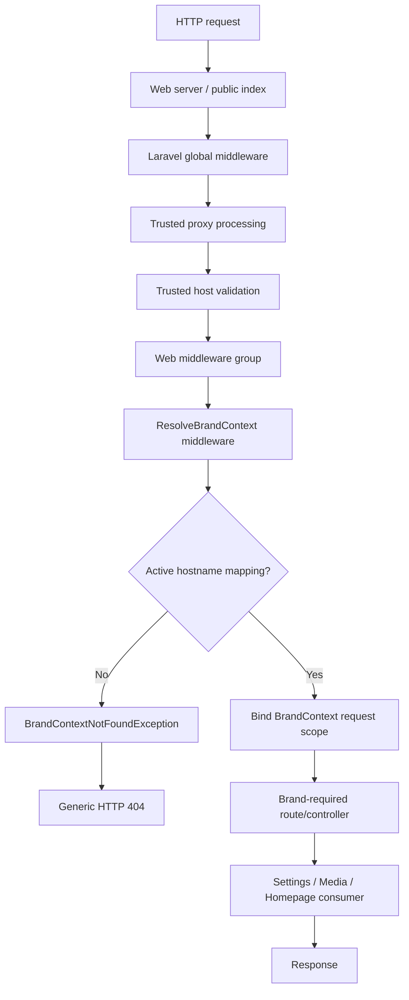
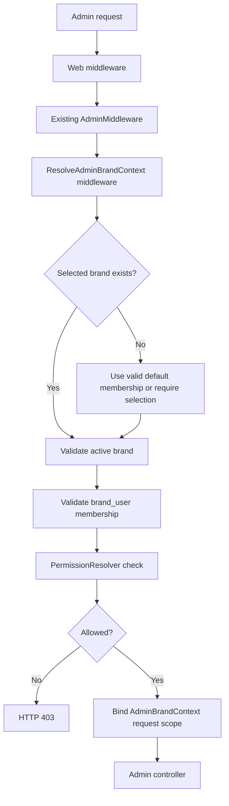

# Brand Context Phase B2 Integration Plan

**Project:** MAAC Durgapur Multi-Brand CMS  
**Status:** Awaiting approval  
**Prepared:** 19 June 2026  
**Scope:** Request-lifecycle integration planning only

## 1. Objective

Integrate the completed Brand Context resolver into the Laravel request
lifecycle without changing current public or admin behavior until each rollout
gate passes.

Approved decisions:

- Unknown public hosts return HTTP 404.
- No implicit MAAC fallback.
- Trusted hosts derive from active `brand_domains`.
- Positive cache TTL is 10 minutes.
- Negative cache TTL is 60 seconds.
- Admin uses one central panel strategy.
- Existing `AdminMiddleware` remains unchanged.

This document authorizes no implementation.

## 2. Scope

### Included

- Public brand-resolution middleware design
- Request-scoped container binding
- Controlled unknown-host handling
- Dynamic trusted-host strategy
- Central admin brand-context strategy
- RBAC integration
- Settings, Media, and Homepage integration contracts
- Cache invalidation design
- Staged rollout and rollback
- Validation requirements

### Excluded

- Middleware implementation
- Route modification
- Provider/container modification
- Exception-handler modification
- Database modification
- Domain-data insertion
- Settings UI implementation
- Public Settings consumption
- Media upload or delivery
- Homepage Builder implementation

## 3. Current Foundation

Completed:

- `brands`
- `brand_domains`
- `brand_user`
- RBAC schema and resolver
- Bootstrap Super Admin assignment
- `BrandContext`
- `HostnameNormalizer`
- `BrandContextResolver`
- Unit tests

Current domain mapping:

```text
maacdurgapur.local -> MAAC
```

Current runtime behavior:

- BrandContext is not bound to the container.
- No middleware calls the resolver.
- No route requires brand context.
- Unknown host behavior is unchanged.
- Public pages continue using legacy behavior.
- Admin uses legacy `AdminMiddleware`.

## 4. Architecture Overview

Two related contexts are required.

### Public Brand Context

Source:

```text
Request hostname
```

Authority:

```text
active brand_domains row + active brands row
```

### Admin Editing Context

Source:

```text
Central admin session selection
```

Authority:

```text
active brand + brand_user membership + RBAC permission
```

The public hostname does not determine the admin editing brand under the
central-admin strategy.

## 5. Request Lifecycle Diagram

### Public request



### Central admin request



## 6. Exact File Inventory

### New middleware files

1. `app/Http/Middleware/ResolveBrandContext.php`
2. `app/Http/Middleware/RequireBrandContext.php`
3. `app/Http/Middleware/ResolveAdminBrandContext.php`
4. `app/Http/Middleware/ValidateBrandHost.php`

### New context/support classes

5. `app/Services/Brands/AdminBrandContext.php`
6. `app/Services/Brands/BrandContextManager.php`
7. `app/Services/Brands/BrandDomainCache.php`

`BrandContextManager` owns request-local binding and retrieval. It must not
become a static global.

### New exception

8. `app/Exceptions/BrandContextNotFoundException.php`

### New console command

9. `app/Console/Commands/InvalidateBrandDomainCache.php`

Purpose:

- Explicitly invalidate one hostname or all brand-domain mappings after
  approved domain data changes.

### New configuration

10. `config/brands.php`

Configuration:

- Positive TTL: 600 seconds
- Negative TTL: 60 seconds
- Unknown-host response: 404
- Admin strategy: central
- Cache prefix/version
- Operational host allowlist
- Health-check exclusions

### New error view

11. `resources/views/errors/brand-not-found.blade.php`

Requirements:

- Brand-neutral
- No domain/database details
- HTTP 404
- No fallback link that assumes MAAC

### New tests

12. `tests/Unit/Brands/BrandContextManagerTest.php`
13. `tests/Unit/Brands/BrandDomainCacheTest.php`
14. `tests/Feature/Brands/BrandContextMiddlewareTest.php`
15. `tests/Feature/Brands/UnknownBrandHostTest.php`
16. `tests/Feature/Brands/TrustedBrandHostTest.php`
17. `tests/Feature/Admin/AdminBrandContextTest.php`
18. `tests/Feature/Admin/AdminBrandRbacTest.php`
19. `tests/Feature/Brands/BrandCacheInvalidationTest.php`

### Existing files to modify

20. `app/Http/Kernel.php`
21. `app/Providers/AppServiceProvider.php`
22. `app/Exceptions/Handler.php`
23. `app/Http/Middleware/TrustHosts.php`
24. `app/Http/Middleware/TrustProxies.php`, only when production proxy details
    are approved
25. `routes/web.php`
26. `routes/admin.php`

### Existing B1 file likely modified

27. `app/Services/Brands/BrandContextResolver.php`

Only for:

- Using configuration-provided TTL values
- Delegating cache-key operations to `BrandDomainCache`
- No change to exact-match/no-fallback semantics

### Explicitly unchanged

- `app/Http/Middleware/AdminMiddleware.php`
- Login controller
- Login routes
- Frontend content templates
- Settings models/data
- Media models/data
- Homepage Builder tables/data
- `site_info`

## 7. Middleware Design

## 7.1 `ValidateBrandHost`

Purpose:

- Reject untrusted Host headers before application URLs are generated.

Behavior:

1. Read the framework-parsed host.
2. Normalize using `HostnameNormalizer`.
3. Allow configured operational hosts.
4. Allow active `brand_domains` hosts through cached lookup.
5. Reject all other hosts with HTTP 404.

This differs from static `TrustHosts` regex configuration because active
brand-domain data is database-driven.

`TrustHosts` should still provide a coarse static boundary where possible.
`ValidateBrandHost` provides the dynamic authoritative check.

## 7.2 `ResolveBrandContext`

Purpose:

- Resolve and attach public brand context.

Behavior:

1. Obtain normalized host.
2. Call `BrandContextResolver`.
3. If unresolved, throw `BrandContextNotFoundException`.
4. Bind the context through `BrandContextManager`.
5. Add it to request attributes.
6. Continue.

It does not:

- Authorize users
- Read posted brand IDs
- Select an admin brand
- Share context globally outside the request

## 7.3 `RequireBrandContext`

Purpose:

- Guard routes/controllers that require a resolved brand.

Behavior:

- Retrieve context from `BrandContextManager`.
- Throw controlled 404 when absent.

This permits the resolver middleware to run in observation mode before every
route is required to use it.

## 7.4 `ResolveAdminBrandContext`

Purpose:

- Resolve editing context for the central admin panel.

Behavior:

1. Require authenticated legacy Admin through existing middleware.
2. Read session key `admin.brand_id`.
3. If absent, use the user's valid default brand membership.
4. If no default exists:
   - Use the sole active membership when exactly one exists.
   - Otherwise require explicit selection.
5. Verify brand is active.
6. Verify active `brand_user` membership.
7. Pass the brand to `PermissionResolver` for the action-specific permission.
8. Bind `AdminBrandContext`.

The middleware should establish brand context, while policies/controllers
perform specific permission checks.

## 8. Container Binding Design

### `BrandContextManager`

Request-scoped service with:

```text
setPublicContext(BrandContext)
publicContext(): ?BrandContext
requirePublicContext(): BrandContext

setAdminContext(AdminBrandContext)
adminContext(): ?AdminBrandContext
requireAdminContext(): AdminBrandContext
```

Rules:

- Setting a different public brand twice in one request throws an exception.
- Context cannot leak between requests.
- Context manager stores objects in memory only.
- Context is not stored in config or static properties.

### Provider binding

`AppServiceProvider` binds `BrandContextManager` using request/singleton scope
appropriate to Laravel 9.

The resolver itself may be container-resolved with:

- `HostnameNormalizer`
- Cache repository
- TTL values from `config/brands.php`

No controller should instantiate the resolver manually.

## 9. Request-Scoped Context Access

Preferred dependency injection:

```text
BrandContextManager
```

or, on routes guaranteed to have public context:

```text
BrandContext
```

Approved access patterns:

- Controller constructor/method injection
- Service injection
- View composer added in a later consuming sprint

Prohibited:

- Global helper querying `brand_domains`
- Static current-brand property
- Re-reading Host in every service
- Trusting request `brand_id`
- Serializing full BrandContext into session

## 10. Trusted Host Strategy

### Two-layer strategy

#### Coarse static trust

`TrustHosts` permits:

- Application-configured operational hosts
- Local development hosts
- Known central admin host
- Host patterns explicitly required by infrastructure

#### Dynamic authoritative trust

`ValidateBrandHost` checks:

- Exact normalized hostname in active `brand_domains`
- Approved operational exception

### Unknown host

Response:

```text
HTTP 404
```

No MAAC fallback and no redirect.

### Central admin host

The central admin hostname must be configured as an operational host. It does
not need to map to a public brand.

Before production implementation, its exact hostname must be approved.

### Proxy strategy

Until production proxy details are approved:

- Do not broaden trusted proxies.
- Local XAMPP uses the direct Host header.
- Future forwarded-host trust must be restricted to explicit proxy IPs.

## 11. Unknown-Host Handling

`BrandContextNotFoundException` maps to:

```text
HTTP 404
```

Response behavior:

- HTML request: brand-neutral 404 view
- JSON request: stable JSON error contract
- No database IDs
- No hostname mapping hints
- No stack trace
- No MAAC redirect

Recommended JSON:

```json
{
  "message": "Resource not found."
}
```

The rejected normalized hostname may be recorded in safe operational logs.

## 12. Central Admin Integration

### Admin hostname

The central admin panel is independent of the public brand hostname.

Example future shape:

```text
admin.example.com
```

Local development may continue using:

```text
maacdurgapur.local/v1/cpanel/admin
```

during transition, but admin editing context comes from membership/session,
not public hostname.

### Session context

Store:

```text
admin.brand_id
```

Do not store:

- Full Brand model
- Permissions
- Role objects
- Domain mapping

Revalidate every request.

### Default selection

Order:

1. Valid session-selected brand
2. Valid default `brand_user` membership
3. Sole valid membership
4. Require user selection

Never use first database brand or primary brand fallback.

## 13. RBAC Integration

### Resolution order

```text
Authenticated user
  -> selected active brand
  -> active brand membership
  -> PermissionResolver
  -> policy/controller action
```

### Bootstrap Super Admin

Current expected behavior:

- MAAC: permitted according to role grants and membership
- AKSHA: denied until membership exists
- Space-E-Fic: denied until membership exists

### Permission examples

Settings page:

```text
settings.brand.view
```

Settings edit:

```text
settings.brand.edit
```

Media library:

```text
media.assets.view
```

The context middleware must not pre-authorize every downstream action merely
because one permission succeeds.

## 14. Settings Integration Strategy

Not implemented in B2, but the contract is:

```text
public BrandContext.brand
  -> published SettingsResolver

admin AdminBrandContext.brand
  -> draft Settings UI
```

Rules:

- Public context reads only published values.
- Admin context may access drafts according to RBAC.
- Public hostname context cannot be overridden by session.
- Cache key uses brand UUID, locale, and publication identifier.
- `site_info` remains authoritative until a later cutover.

## 15. Media Integration Strategy

Not implemented in B2.

Contract:

```text
BrandContext.brand
  -> media query scope
  -> same-brand or approved shared assets
```

Checks:

- Asset brand
- Visibility
- Security classification
- Status
- Usage relationship

Admin media context additionally requires RBAC.

## 16. Homepage Builder Integration Strategy

Not implemented in B2.

Contract:

```text
BrandContext.brand
  -> homepage page_type
  -> published revision
```

No cross-brand fallback:

- AKSHA hostname cannot render MAAC homepage.
- Space-E-Fic hostname cannot render MAAC homepage.

During transition, MAAC may retain the legacy homepage renderer while context
is resolved in shadow mode.

## 17. Cache Invalidation Strategy

### `BrandDomainCache`

Responsibilities:

- Build versioned cache keys
- Read/write positive and negative mappings
- Invalidate one hostname
- Invalidate every hostname for one brand
- Flush only the brand-domain namespace when required

### TTLs

```text
Positive: 600 seconds
Negative: 60 seconds
```

### Invalidation triggers

Future domain service must invalidate after:

- Domain created
- Hostname changed
- Status changed
- Domain deleted
- Primary/preview/redirect flags changed
- Brand activated, deactivated, or archived

### Current operational invalidation

Until a domain-management service exists:

```text
brand-domain:cache-clear --hostname=...
brand-domain:cache-clear --brand=...
brand-domain:cache-clear --all
```

The command must not use global `cache:clear`.

## 18. Route Integration Plan

No route change is authorized by this plan.

Future staged route changes:

### Shadow phase

- Resolver may run without requiring context.
- Existing route behavior remains.
- Mismatches are logged safely.

### Public enforcement phase

Apply:

```text
brand.resolve
brand.required
```

to approved public route group.

Exclude:

- Admin login
- Central admin operational routes
- Health checks
- Explicitly brand-neutral endpoints

### Admin phase

Apply:

```text
AdminMiddleware
admin.brand
```

to approved brand-aware admin modules.

## 19. Risks

### R1 — Public outage from middleware ordering

**Severity:** Critical

If resolution runs before host/proxy normalization or on static assets, valid
requests may 404.

Control:

- Explicit route-group rollout
- Unit and feature tests
- Shadow mode first

### R2 — Central admin host treated as unknown brand

**Severity:** Critical

Control:

- Separate operational-host allowlist
- Do not require public BrandContext on central admin routes

### R3 — Host-header poisoning

**Severity:** Critical

Control:

- Coarse trusted-host rules
- Dynamic exact active-domain validation
- Restricted proxy trust

### R4 — Cross-request context leakage

**Severity:** Critical

Control:

- Request-scoped manager
- No static state
- Long-running worker tests if Octane is introduced

### R5 — Admin session tampering

**Severity:** High

Control:

- Store ID only
- Revalidate brand, membership, and permission every request

### R6 — Stale cache after domain changes

**Severity:** High

Control:

- Explicit invalidation command
- Ten-minute positive TTL
- Sixty-second negative TTL

### R7 — Public and admin contexts confused

**Severity:** Critical

Control:

- Separate value objects/accessors
- Central admin ignores public hostname for editing authority

### R8 — Existing `maacdurgapur.local` aliases

**Severity:** Medium

Requests through `localhost` or `127.0.0.1` will 404 once enforcement begins
unless explicitly configured as operational/local hosts.

Control:

- Document approved local hostnames
- Enforce only after developer workflow verification

### R9 — Legacy public routes expect no brand

**Severity:** High

Control:

- Route inventory
- Shadow mode
- Apply middleware only to reviewed routes

## 20. Validation Plan

### Unit tests

- Context manager cannot be overwritten with another brand.
- Context does not leak between application requests.
- Cache keys use normalized hostname.
- Positive TTL is 600 seconds.
- Negative TTL is 60 seconds.
- Invalidation removes only intended entries.

### Feature tests: trusted hosts

- Configured active MAAC host accepted.
- Unknown host returns HTTP 404.
- Inactive domain returns 404.
- Inactive brand returns 404.
- No redirect/fallback to MAAC.
- Invalid Host rejected.

### Feature tests: lifecycle

- Context is available in a protected test route.
- Controller/service receives identical context.
- Resolver runs once per request.
- Brand-neutral route works without context.

### Feature tests: admin

- Existing login remains unchanged.
- Existing `AdminMiddleware` remains unchanged.
- Bootstrap administrator resolves MAAC admin context.
- AKSHA selection is denied without membership.
- Tampered session brand is denied.
- Revoked membership immediately invalidates context.

### Integration-contract tests

Use test doubles only:

- Settings consumer receives MAAC.
- Media consumer receives MAAC.
- Homepage consumer receives MAAC.
- No real Settings, media, or homepage data is modified.

### Regression

- Homepage HTTP 200 during shadow mode.
- Admin login HTTP 200.
- CSS/JS/images/video HTTP 200.
- `site_info` checksum unchanged.
- No database migration.
- No route behavior change before enforcement gate.

## 21. Implementation Sequence

### B2.1 — Context manager and cache service

- Implement request-scoped context manager.
- Extract cache behavior.
- Unit tests only.

### B2.2 — Exception and host validation

- Implement exception rendering.
- Implement dynamic host validation.
- Feature tests on isolated test routes.

### B2.3 — Public resolver middleware in shadow mode

- Resolve context.
- Do not require context.
- No consumer changes.
- Monitor expected mapping.

### B2.4 — Admin context middleware

- Central admin session selection.
- Membership and RBAC checks.
- No UI switcher yet.

### B2.5 — Route enforcement gate

Requires separate approval:

- Modify route groups.
- Unknown hosts begin returning 404.

### B2.6 — Consumer gates

Separate approvals:

- Settings
- Media
- Homepage Builder

## 22. Rollback Plan

### Before route enforcement

Remove new middleware/provider bindings. Existing behavior remains unaffected.

### After shadow middleware

- Remove `brand.resolve` from route group.
- Keep B1 resolver classes.
- Clear brand-domain namespace cache only.

### After public enforcement

- Remove `brand.required`.
- Restore legacy route behavior.
- Do not enable MAAC fallback.
- Unknown hosts may return to web-server/default behavior only during emergency
  rollback.

### Admin rollback

- Remove `admin.brand` from brand-aware modules.
- Clear `admin.brand_id` session context.
- Preserve existing `AdminMiddleware`.

### No database rollback

No migration is planned. Existing brand/domain data remains intact.

## 23. Blockers Before Implementation

1. Exact central admin hostname for production
2. Approved operational hosts and health-check hosts
3. Production reverse-proxy topology
4. Whether `localhost` and `127.0.0.1` remain accepted locally
5. Admin default-brand behavior when memberships exceed one
6. Error-view content approval
7. Shadow-mode observation period

## 24. Definition of Done

B2 integration is complete when:

1. Context is bound once per request.
2. Active configured brand hosts resolve correctly.
3. Unknown hosts return 404 after enforcement approval.
4. No MAAC fallback exists.
5. Central admin routes remain operational.
6. Admin editing context requires membership and RBAC.
7. Public and admin contexts cannot be confused.
8. Positive and negative cache TTLs match approval.
9. Domain cache can be invalidated without global cache clearing.
10. Settings, Media, and Homepage contracts are ready but not activated.
11. Existing login and `AdminMiddleware` behavior remain unchanged.
12. Rollback is tested.

## 25. Approval Gate

Approval is required for:

1. Exact file inventory
2. Two-layer trusted-host strategy
3. Request-scoped context manager
4. Central admin context rules
5. Shadow-mode implementation sequence
6. Exception and 404 behavior
7. Cache invalidation command
8. Rollback plan

No B2 implementation should begin until this plan is approved.
