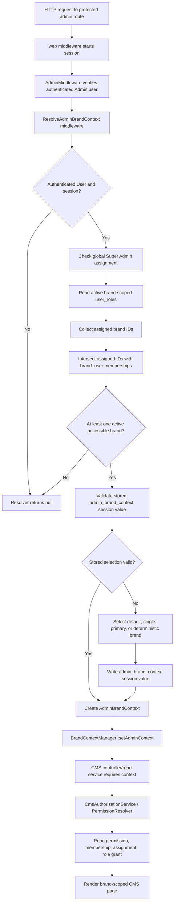

# CMS Admin Brand Context Debug Report

**Date:** June 20, 2026  
**Environment:** Local XAMPP / `maacdurgapur.local`  
**Affected user:** `admin@gmail.com` (`users.id = 3`)  
**Affected brand:** MAAC Durgapur

## Executive Summary

`AdminBrandContextResolver::resolve()` returned `null` because the active Brand
Admin role assignment and the user-to-brand membership were inconsistent.

The role assignment identified brand 1 as accessible in principle, but
`AdminBrandAccessResolver` deliberately intersects role-assigned brands with
the user's `brand_user` memberships. The `brand_user` table had zero rows.
Consequently, the intersection returned zero brands, the resolver executed its
empty-access branch, and no `AdminBrandContext` was bound.

Two additional data defects were corrected during the same minimal repair:

1. `user_roles.scope_key` was `brand`, but `PermissionResolver` requires the
   canonical `brand:{brand_uuid}` value.
2. Apache serves the project as `maacdurgapur.local`, but the active primary
   `brand_domains.hostname` was `127.0.0.1`. The hostname resolver rejects IP
   addresses as brand domains, and Apache does not serve this project from the
   generic `127.0.0.1` virtual host.

No application PHP source, CMS implementation, route, controller, migration,
permission catalogue, or security middleware was modified.

## Root Cause

### Exact null-return path

1. `ResolveAdminBrandContext` called the resolver:
   - `app/Http/Middleware/ResolveAdminBrandContext.php:19`
2. `AdminBrandContextResolver` obtained the authenticated user and confirmed
   the request had a session:
   - `app/Services/Brands/AdminBrandContextResolver.php:20-24`
3. It requested the user's accessible brands:
   - `app/Services/Brands/AdminBrandContextResolver.php:26`
4. `AdminBrandAccessResolver` found the active brand-scoped assignment in
   `user_roles` and obtained `brand_id = 1`:
   - `app/Services/Brands/AdminBrandAccessResolver.php:22-31`
5. It then queried `$user->brands()`, which is a `brands` to `brand_user`
   inner join:
   - `app/Services/Brands/AdminBrandAccessResolver.php:37-42`
   - `app/Models/User.php:45-50`
6. `brand_user` contained no `(user_id = 3, brand_id = 1)` row, so the inner
   join returned zero rows.
7. `$accessibleBrands->isEmpty()` evaluated to true:
   - `app/Services/Brands/AdminBrandContextResolver.php:28`
8. The resolver removed any stale session selection and returned `null`:
   - `app/Services/Brands/AdminBrandContextResolver.php:29-31`
9. The middleware therefore skipped `BrandContextManager::setAdminContext()`:
   - `app/Http/Middleware/ResolveAdminBrandContext.php:21-23`
10. The CMS page read service later called
    `BrandContextManager::requireAdminContext()`, which threw:
    - `app/Services/Brands/BrandContextManager.php:59-63`

### Failing SQL/data dependency

The assignment query correctly returned brand 1:

```sql
select `brand_id`
from `user_roles`
where `status` = 'active'
  and `user_id` = 3
  and `brand_id` is not null
  and exists (
      select *
      from `roles`
      where `user_roles`.`role_id` = `roles`.`id`
        and `scope_type` = 'brand'
        and `status` = 'active'
        and `roles`.`deleted_at` is null
  );
```

The next query returned zero rows before the fix:

```sql
select `brands`.*
from `brands`
inner join `brand_user`
    on `brands`.`id` = `brand_user`.`brand_id`
where `brand_user`.`user_id` = 3
  and `brands`.`id` in (1)
  and `brands`.`status` = 'active'
  and `brands`.`deleted_at` is null;
```

Data evidence before the fix:

| Dependency | Before |
|---|---|
| Active user | User 3 present |
| Active brand | Brand 1 present |
| Active Brand Admin role | Present |
| Active brand-scoped assignment | Present |
| `role_permissions` CMS grants | 17 present |
| `brand_user` membership | **Missing** |
| `user_roles.scope_key` | **`brand` (invalid canonical scope)** |
| Primary domain | **`127.0.0.1` (not the Apache application host)** |

## Resolution Flow



## Tables Queried and Required Conditions

### Authentication and session

| Dependency | Requirement |
|---|---|
| `users` | Authenticated user must exist and be returned by the web guard. |
| Session driver | The request must pass through `web` middleware and have an active session. |
| Session key | Optional `admin_brand_context`; invalid or stale values are discarded. |

Session key structure written after successful default selection:

```json
{
  "brand_id": 1,
  "brand_uuid": "7d6a1b28-8bf2-43a4-b18a-93d9870c45fe",
  "user_id": 3,
  "source": "user_default",
  "selected_at": "ISO-8601 timestamp"
}
```

### Admin brand resolution

| Table | Conditions |
|---|---|
| `user_roles` | `user_id` matches; status active; start time reached; not expired; brand ID present for brand roles. |
| `roles` | Assignment role exists; status active; `scope_type = brand`. |
| `brands` | Assigned brand exists; status active; not soft deleted. |
| `brand_user` | Exact user/brand membership exists. This was missing. |

Global Super Admin resolution instead requires:

- `user_roles.brand_id IS NULL`
- `user_roles.scope_key = global`
- active role code `super_admin`
- role scope type `global`

### Default selection

The resolver selects in this order:

1. Active `brand_user.is_default = true` membership.
2. The only accessible brand when exactly one exists.
3. Primary brand for a global Super Admin.
4. First deterministically ordered accessible brand.

Relevant code:

- `app/Services/Brands/AdminBrandContextResolver.php:80-106`
- `app/Services/Brands/AdminBrandAccessResolver.php:61-75`

### RBAC after context resolution

| Table | Conditions |
|---|---|
| `permissions` | Exact `cms.{module}.{operation}` code; active status. |
| `brand_user` | Brand membership must still exist for non-global-Super-Admin users. |
| `user_roles` | Active assignment with `scope_key = brand:{brand_uuid}` and matching `brand_id`. |
| `roles` | Active assigned role, including active inherited parent roles if configured. |
| `role_permissions` | Assigned role or inherited role must grant the requested permission. |

Canonical scope enforcement is located at:

- `app/Services/Authorization/PermissionResolver.php:21`
- `app/Services/Authorization/PermissionResolver.php:149-169`

The original `scope_key = brand` assignment would have produced
`role_assignment_missing` after the context issue was repaired.

### Trusted host dependency

Before route middleware executes, global `TrustHosts` validates either:

- a configured operational host, or
- an active `brand_domains` hostname attached to an active brand.

Relevant code:

- `app/Http/Kernel.php:16-25`
- `app/Http/Middleware/TrustHosts.php:38-63`
- `app/Services/Brands/BrandContextResolver.php:19-28`

Apache configuration evidence:

- `C:/xampp/apache/conf/extra/httpd-vhosts.conf`
- `ServerName maacdurgapur.local`
- Document root `C:/xampp/htdocs/maacdurgapur/public`

## Files Inspected

- `app/Http/Middleware/ResolveAdminBrandContext.php`
- `app/Http/Middleware/TrustHosts.php`
- `app/Http/Middleware/AdminMiddleware.php`
- `app/Http/Kernel.php`
- `app/Providers/AppServiceProvider.php`
- `app/Services/Brands/AdminBrandContextResolver.php`
- `app/Services/Brands/AdminBrandContext.php`
- `app/Services/Brands/AdminBrandAccessResolver.php`
- `app/Services/Brands/BrandContextManager.php`
- `app/Services/Brands/BrandContextResolver.php`
- `app/Services/Brands/BrandDomainCache.php`
- `app/Services/Brands/HostnameNormalizer.php`
- `app/Services/Authorization/PermissionResolver.php`
- `app/Models/User.php`
- `app/Models/Brand.php`
- `app/Models/BrandDomain.php`
- `app/Models/BrandMembership.php`
- `app/Models/UserRole.php`
- `app/Models/Role.php`
- `routes/admin.php`
- `config/brands.php`
- `database/migrations/2026_06_19_100200_create_brand_user_table.php`
- `database/migrations/2026_06_19_130300_create_user_roles_table.php`
- `C:/xampp/apache/conf/extra/httpd-vhosts.conf`
- `C:/Windows/System32/drivers/etc/hosts`

## Fix Applied

### Backup

Database backup created before mutation:

`storage/app/backups/before_cms_brand_context_fix_20260620_035344.sql`

SHA-256:

`46C1114504F4E69D6B626742D63525958050ED755BDB156B9E48E40A4C72D48F`

### Data corrections

The repair derived the user and brand from the single active Brand Admin
assignment; no brand ID was hardcoded.

1. Created the missing `brand_user` membership:
   - user: 3
   - brand: 1
   - `is_default = true`
2. Corrected the same assignment's scope:
   - before: `brand`
   - after: `brand:7d6a1b28-8bf2-43a4-b18a-93d9870c45fe`
3. Corrected the existing active primary brand domain to match Apache:
   - before: `127.0.0.1`
   - after: `maacdurgapur.local`
4. Invalidated only the affected old and new hostname cache keys.

No additional user, role, assignment, permission, brand, or domain record was
created.

## Before and After Validation

| Check | Before | After |
|---|---|---|
| Assigned brand IDs | `[1]` | `[1]` |
| Accessible brand count | `0` | `1` |
| Resolver result | `null` | `AdminBrandContext` |
| Context source | None | `user_default` |
| `cms.faqs.view` | Unreachable | `granted` |
| `cms.courses.view` | Unreachable | `granted` |
| `cms.features.view` | Unreachable | `granted` |
| `cms.showcase.view` | Unreachable | `granted` |
| Canonical host | HTTP 404 | HTTP 200 |
| Authenticated FAQs page | Context exception | HTTP 200 |
| Authenticated Courses page | Context exception | HTTP 200 |
| Authenticated Features page | Context exception | HTTP 200 |
| Authenticated Showcase page | Context exception | HTTP 200 |

Direct resolver verification:

```text
resolved: true
brand_id: 1
brand_uuid: 7d6a1b28-8bf2-43a4-b18a-93d9870c45fe
source: user_default
```

Authenticated HTTP verification:

```text
login_json_status=200
faqs=200
courses=200
features=200
showcase=200
```

Automated resolver tests:

```text
Tests: 4 passed
```

CMS Admin UI feature tests were also previously validated at the page layer,
and the live HTTP checks above confirm the real database/session/RBAC chain.

## Screenshot Evidence

### FAQs


### Courses


### Features


### Showcase


## Security Assessment

The fix preserves all intended controls:

- No brand fallback was introduced.
- No hardcoded brand ID was added.
- No resolver or middleware bypass was added.
- Brand membership remains mandatory.
- Canonical role scope remains mandatory.
- Permissions remain enforced through `CmsAuthorizationService`.
- Unknown hosts continue to return HTTP 404.
- The admin context is still request-scoped.

## Rollback

Preferred complete rollback:

1. Stop writes to the local database.
2. Restore:
   `storage/app/backups/before_cms_brand_context_fix_20260620_035344.sql`
3. Clear application and brand-domain caches.
4. Log out and log back in to discard the `admin_brand_context` session key.

A targeted rollback would remove the new `brand_user` membership, restore the
assignment's former `scope_key = brand`, and restore the former
`brand_domains.hostname = 127.0.0.1`. That rollback intentionally restores the
original broken state and is only appropriate for forensic reproduction.

## Final Status

**Root cause identified:** Yes  
**Minimal fix applied:** Yes  
**Security bypass introduced:** No  
**All four authenticated CMS pages:** HTTP 200  
**Brand context exception:** Resolved
