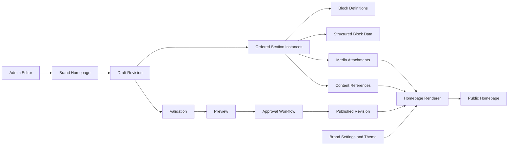
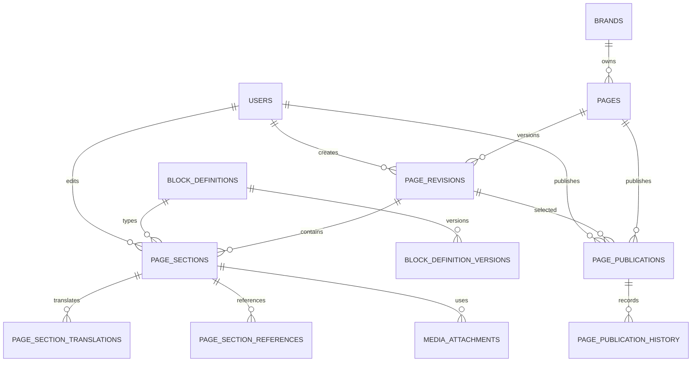
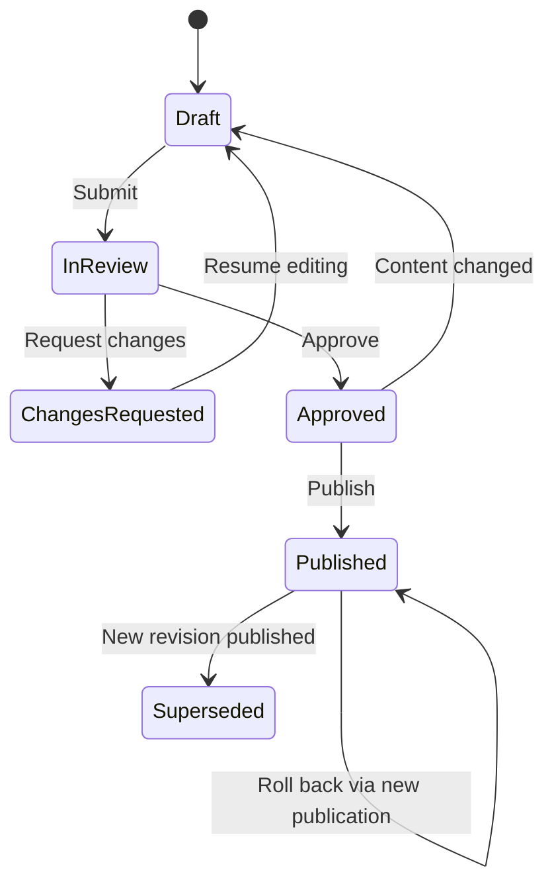

# Homepage Builder Architecture

**Project:** MAAC Durgapur Multi-Brand CMS  
**Document type:** Architecture proposal  
**Status:** Awaiting approval  
**Prepared:** 19 June 2026  
**Scope:** Dynamic, multi-brand homepage composition and publishing

## 1. Purpose

This document defines a fully dynamic homepage builder for:

- MAAC
- AKSHA
- Space-E-Fic

The builder allows authorized administrators to manage homepage content,
section order, visibility, responsive presentation, media, calls to action, and
publication without editing Blade templates.

It supports:

- Hero sections
- MAAC sections
- AKSHA sections
- Space-E-Fic sections
- Placement sections
- Testimonials
- FAQs
- CTA blocks
- Statistics
- Galleries
- Video blocks
- Custom content blocks

The design integrates with the approved:

- Multi-brand architecture
- Settings Module
- Media Manager
- RBAC system
- Approval workflow
- Activity and audit logs

This document defines architecture only. It does not authorize code,
migrations, seeders, package installation, content migration, or UI changes.

## 2. Goals

1. Make homepage content admin-managed.
2. Preserve a controlled visual system and responsive behavior.
3. Give each brand an independent homepage.
4. Allow safe section reordering and visibility scheduling.
5. Support preview, review, approval, and publication.
6. Preserve immutable version history.
7. Roll back without restoring database backups.
8. Reuse Media Manager assets rather than filesystem paths.
9. Prevent editors from introducing scripts or unsafe markup.
10. Allow future block types without redesigning page storage.

## 3. Non-Goals

The initial builder is not:

- A free-form visual website designer
- A raw HTML, JavaScript, CSS, Blade, or PHP editor
- A replacement for global Settings
- A replacement for structured course, placement, FAQ, or testimonial modules
- A landing-page system for unlimited page types
- An Animation Manager implementation
- An analytics implementation

The architecture is reusable for future page building, but the first approved
scope is the homepage.

## 4. Design Principles

### 4.1 Structured blocks

Editors choose approved block types and edit validated fields. They do not
write executable templates.

### 4.2 Schema-driven administration

Each block type defines:

- Available fields
- Data types
- Validation rules
- Media requirements
- Allowed design variants
- Responsive options
- Permission requirements
- Rendering component

### 4.3 Immutable revisions

Draft editing creates page revisions. Published revisions remain unchanged.
Rollback republishes an earlier revision as a new publication event.

### 4.4 Separate content from presentation

Content is stored in structured fields. Presentation is selected from approved
variants and theme tokens.

### 4.5 Multi-brand isolation

Every homepage belongs to one brand. Cross-brand copying is explicit and does
not create shared mutable content.

### 4.6 Reuse domain content

Placement, testimonial, FAQ, and course-related sections may select records
from their dedicated modules. They should not duplicate business records inside
homepage JSON.

### 4.7 Safe degradation

If optional animation, video, or advanced media fails, the block retains an
accessible static fallback.

### 4.8 Performance budget

The builder may not allow unlimited heavy video, Three.js, or animation blocks
without validation and warnings.

## 5. High-Level Architecture



## 6. Content Ownership Model

Each brand owns one canonical homepage record.

```text
Brand
  -> Homepage
      -> Revisions
          -> Ordered Sections
              -> Structured data
              -> Media attachments
              -> Related CMS records
```

The homepage record stores identity and publication pointers. A revision stores
a complete renderable composition.

## 7. Database Schema Overview

Proposed tables:

1. `pages`
2. `page_revisions`
3. `page_sections`
4. `page_section_translations`
5. `block_definitions`
6. `block_definition_versions`
7. `page_section_references`
8. `page_publications`
9. `page_publication_history`
10. Existing `media_attachments`
11. Existing approval, activity, and audit tables

The schema is designed for future reusable pages while limiting initial
administrative scope to `page_type = homepage`.

## 8. `pages`

Canonical page identity and publication state.

| Column | Type | Purpose |
|---|---|---|
| `id` | bigint | Primary key |
| `uuid` | UUID | Stable public-safe identifier |
| `brand_id` | bigint | Owning brand |
| `page_type` | varchar(50) | Initially `homepage` |
| `name` | varchar(190) | Administrative name |
| `slug` | varchar(190), nullable | Null or `/` representation for homepage |
| `status` | varchar(30) | `active`, `inactive`, `archived` |
| `current_draft_revision_id` | bigint, nullable | Active editing revision |
| `published_revision_id` | bigint, nullable | Current public revision |
| `created_by` | bigint | Creating user |
| `updated_by` | bigint | Last administrative editor |
| `created_at` | timestamp | Audit timestamp |
| `updated_at` | timestamp | Audit timestamp |
| `deleted_at` | timestamp, nullable | Soft deletion |

Constraints:

- Unique `uuid`
- Unique active `brand_id`, `page_type`, `slug`
- Exactly one active homepage per brand
- Published revision must belong to the same page
- Homepage cannot be hard-deleted while its brand is active

## 9. `page_revisions`

Immutable or controlled-mutation version of a page composition.

| Column | Type | Purpose |
|---|---|---|
| `id` | bigint | Primary key |
| `uuid` | UUID | Stable revision identifier |
| `page_id` | bigint | Page foreign key |
| `revision_number` | integer | Monotonic page version |
| `based_on_revision_id` | bigint, nullable | Source revision |
| `status` | varchar(30) | Revision workflow state |
| `title` | varchar(255), nullable | Page title override |
| `meta_summary` | varchar(500), nullable | Administrative summary |
| `change_summary` | text, nullable | Editor change note |
| `schema_version` | integer | Builder data contract version |
| `content_hash` | char(64) | Integrity/change detection |
| `created_by` | bigint | Revision creator |
| `submitted_by` | bigint, nullable | Submitter |
| `submitted_at` | timestamp, nullable | Submission time |
| `approved_by` | bigint, nullable | Final approver shortcut |
| `approved_at` | timestamp, nullable | Approval time |
| `created_at` | timestamp | Revision creation time |
| `updated_at` | timestamp | Draft editing time |

Revision statuses:

- `draft`
- `in_review`
- `changes_requested`
- `approved`
- `published`
- `superseded`
- `archived`

Constraints:

- Unique `page_id`, `revision_number`
- Unique `uuid`
- Published revisions are immutable
- Submitted revisions are locked except for workflow comments until returned
- The content hash is recalculated before submission and publication

## 10. `block_definitions`

Registry of approved block types.

| Column | Type | Purpose |
|---|---|---|
| `id` | bigint | Primary key |
| `code` | varchar(100) | Immutable unique block code |
| `name` | varchar(190) | Admin label |
| `description` | text, nullable | Usage guidance |
| `category` | varchar(100) | Builder category |
| `renderer_key` | varchar(190) | Approved render component identifier |
| `icon` | varchar(100), nullable | Admin icon |
| `current_schema_version` | integer | Active field schema |
| `minimum_instances` | integer | Page validation rule |
| `maximum_instances` | integer, nullable | Page validation rule |
| `allowed_page_types` | JSON | Initially homepage |
| `supported_brands` | JSON, nullable | Null means all brands |
| `is_system` | boolean | Protected definition |
| `status` | varchar(30) | `active`, `deprecated`, `inactive` |
| `created_at` | timestamp | Audit timestamp |
| `updated_at` | timestamp | Audit timestamp |

The renderer key is selected from an application-owned allowlist. It is not a
Blade path supplied by an administrator.

## 11. `block_definition_versions`

Versioned schemas for block configuration and validation.

| Column | Type | Purpose |
|---|---|---|
| `id` | bigint | Primary key |
| `block_definition_id` | bigint | Definition foreign key |
| `schema_version` | integer | Version number |
| `field_schema` | JSON | Field and validation definition |
| `allowed_variants` | JSON | Approved visual variants |
| `responsive_schema` | JSON | Approved responsive controls |
| `media_contract` | JSON | Media roles and constraints |
| `reference_contract` | JSON | Allowed related content types |
| `default_data` | JSON | New-instance defaults |
| `migration_strategy` | JSON, nullable | Future schema conversion metadata |
| `status` | varchar(30) | `active`, `deprecated` |
| `created_at` | timestamp | Audit timestamp |

Constraints:

- Unique `block_definition_id`, `schema_version`
- Existing published sections retain their schema version
- Schema upgrades do not mutate historical revisions

## 12. `page_sections`

Ordered block instance within one page revision.

| Column | Type | Purpose |
|---|---|---|
| `id` | bigint | Primary key |
| `uuid` | UUID | Stable instance identifier |
| `page_revision_id` | bigint | Revision foreign key |
| `block_definition_id` | bigint | Block type |
| `block_schema_version` | integer | Schema used by this instance |
| `internal_name` | varchar(190) | Editor-facing label |
| `anchor_id` | varchar(100), nullable | Unique safe page anchor |
| `sort_order` | integer | Section order |
| `status` | varchar(30) | `enabled`, `disabled`, `scheduled` |
| `variant` | varchar(100) | Approved design variant |
| `data` | JSON | Non-translatable structured fields |
| `responsive_settings` | JSON, nullable | Approved visibility/layout controls |
| `animation_profile` | varchar(100), nullable | Future Animation Manager reference |
| `visible_from` | timestamp, nullable | Optional schedule |
| `visible_until` | timestamp, nullable | Optional schedule |
| `created_by` | bigint | Creator |
| `updated_by` | bigint | Last editor |
| `created_at` | timestamp | Audit timestamp |
| `updated_at` | timestamp | Audit timestamp |

Constraints:

- Unique `uuid`
- Unique `page_revision_id`, `sort_order`
- Unique non-null `page_revision_id`, `anchor_id`
- Definition and schema version must be valid
- Variant must be allowed by the definition version
- Scheduling cannot bypass page publication status

The `data` JSON contains only fields declared by the block schema. Unknown keys
are rejected or removed by controlled validation.

## 13. `page_section_translations`

Translatable block content.

| Column | Type | Purpose |
|---|---|---|
| `id` | bigint | Primary key |
| `page_section_id` | bigint | Section foreign key |
| `locale` | varchar(10) | Locale |
| `data` | JSON | Schema-approved translated fields |
| `translation_status` | varchar(30) | `draft`, `complete`, `needs_review` |
| `updated_by` | bigint | Last translator/editor |
| `created_at` | timestamp | Audit timestamp |
| `updated_at` | timestamp | Audit timestamp |

Constraints:

- Unique `page_section_id`, `locale`
- Only fields marked translatable may appear
- Brand default locale is required before publication

Initial implementation may use English only while retaining this compatible
structure.

## 14. `page_section_references`

Links sections to structured CMS records.

| Column | Type | Purpose |
|---|---|---|
| `id` | bigint | Primary key |
| `page_section_id` | bigint | Section foreign key |
| `reference_type` | varchar(100) | Controlled morph-map alias |
| `reference_id` | bigint | Related CMS record |
| `collection` | varchar(100) | Semantic relationship |
| `sort_order` | integer | Manual display order |
| `settings` | JSON, nullable | Context-specific presentation |
| `created_at` | timestamp | Audit timestamp |
| `updated_at` | timestamp | Audit timestamp |

Examples:

- Placement records in `featured_placements`
- Testimonials in `selected_testimonials`
- FAQs in `selected_faqs`
- Courses in `featured_courses`

Rules:

- References must belong to the same brand or be explicitly shared.
- Only published/eligible records may appear on the public homepage.
- Deleting a referenced record must trigger an impact check.
- Raw PHP model class names are not stored.

## 15. Media Relationships

The approved `media_attachments` table connects Media Manager assets to:

- Page revisions for page-level defaults
- Page sections for block-specific media

Recommended attachment collections:

- `background`
- `desktop_background`
- `tablet_background`
- `mobile_background`
- `foreground`
- `logo`
- `poster`
- `video`
- `gallery`
- `icon`
- `decorative`

Each block definition's media contract controls:

- Allowed media types
- Single or multiple selection
- Required dimensions
- Aspect-ratio guidance
- Public visibility requirement
- Mobile fallback requirement
- Alt-text requirement
- Maximum file size
- Maximum video duration

No page section stores absolute media URLs or filesystem paths.

## 16. `page_publications`

Records each publication attempt and its current deployment state.

| Column | Type | Purpose |
|---|---|---|
| `id` | bigint | Primary key |
| `uuid` | UUID | Publication identifier |
| `page_id` | bigint | Page foreign key |
| `page_revision_id` | bigint | Published revision |
| `previous_revision_id` | bigint, nullable | Rollback reference |
| `approval_request_id` | bigint, nullable | Approval evidence |
| `status` | varchar(30) | Publication lifecycle |
| `publish_at` | timestamp, nullable | Scheduled publication |
| `published_at` | timestamp, nullable | Effective time |
| `published_by` | bigint, nullable | Publisher |
| `failure_code` | varchar(100), nullable | Safe failure identifier |
| `failure_message` | text, nullable | Sanitized description |
| `created_at` | timestamp | Audit timestamp |
| `updated_at` | timestamp | Audit timestamp |

Statuses:

- `pending`
- `scheduled`
- `publishing`
- `published`
- `failed`
- `superseded`
- `rolled_back`
- `cancelled`

## 17. `page_publication_history`

Append-only publication state transitions.

| Column | Type | Purpose |
|---|---|---|
| `id` | bigint | Primary key |
| `page_publication_id` | bigint | Publication foreign key |
| `from_status` | varchar(30), nullable | Previous state |
| `to_status` | varchar(30) | New state |
| `actor_id` | bigint, nullable | User or system actor |
| `reason` | text, nullable | Rollback/failure reason |
| `metadata` | JSON, nullable | Safe operational data |
| `created_at` | timestamp | Transition time |

## 18. Entity Relationship Diagram



## 19. Block Architecture

Each block has four layers:

```text
Block Definition
  -> Versioned field schema
  -> Page section instance
  -> Approved renderer
```

### Definition responsibilities

- Field types
- Validation
- Defaults
- Variants
- Responsive controls
- Media contract
- Related-record contract
- Instance limits

### Section responsibilities

- Content values
- Brand revision ownership
- Order
- Visibility
- Variant selection
- Media attachments
- Related records
- Scheduling

### Renderer responsibilities

- Escape ordinary text
- Render sanitized rich text
- Resolve Media Manager variants
- Apply brand theme tokens
- Produce semantic HTML
- Support keyboard and assistive technologies
- Apply responsive behavior
- Emit analytics hooks
- Provide static fallbacks

## 20. Common Block Fields

Approved blocks may share:

- Eyebrow text
- Heading
- Subheading
- Body content
- Background color token
- Text color token
- Section width
- Section spacing preset
- Alignment
- CTA collection
- Anchor ID
- Visibility schedule
- Responsive visibility
- Media
- Accessibility label

Values use approved tokens rather than arbitrary CSS.

## 21. Hero Section

Purpose: primary above-the-fold brand message.

Fields:

- Eyebrow
- Heading
- Supporting text
- Primary CTA
- Secondary CTA
- Trust label or badge
- Alignment
- Overlay strength
- Minimum height preset

Media:

- Desktop background image or video
- Tablet background
- Mobile background
- Poster/fallback image
- Optional foreground image/logo

Variants:

- Full-bleed media
- Split content/media
- Centered campaign
- Video hero
- Slider hero only if explicitly approved

Rules:

- At least one accessible heading
- Maximum CTA count
- Mobile fallback required for video
- Autoplay video must be muted and non-blocking
- Reduced-motion mode uses the poster/static image
- Performance warning for oversized assets

Recommended page rule: one enabled Hero Section.

## 22. MAAC, AKSHA, and Space-E-Fic Sections

Purpose: present the institutes/brands on the primary multi-brand homepage or
feature a related brand proposition.

Shared fields:

- Section heading
- Brand logo
- Description
- Key benefits
- Featured courses or service links
- CTA
- Background/foreground media
- Brand color treatment

Specific block codes:

- `brand_maac`
- `brand_aksha`
- `brand_space_e_fic`

The explicit block types allow distinct validated layouts while sharing a
common field contract.

Rules:

- A brand's own homepage may feature itself without cross-brand permission.
- Referencing another brand requires an approved cross-brand content policy.
- Brand logos resolve through Settings/Media unless an approved section
  override is provided.
- Cross-brand links use brand domain mappings.

## 23. Placement Section

Purpose: display verified student placement outcomes and recruiters.

Data sources:

- Placement records
- Recruiter/company records
- Approved public student media

Selection modes:

- Manual selection
- Latest verified
- Featured placements
- Filter by course/category/year

Fields:

- Heading and supporting text
- Selection mode
- Item limit
- Card variant
- Recruiter display toggle
- CTA

Rules:

- Only verified and publishable placement records are eligible.
- Private evidence is never rendered.
- Marketing claims must use approved structured values.
- Empty-state behavior is configured.
- Placement Coordinator may manage source records but publication follows RBAC.

## 24. Testimonials Section

Selection modes:

- Manual selection
- Featured testimonials
- Latest published
- Course/brand filtered

Fields:

- Heading
- Supporting text
- Item limit
- Card/carousel variant
- Rating visibility
- CTA

Rules:

- Only consented, published testimonials are eligible.
- Media must be public.
- Empty quotes or missing attribution are rejected.
- Carousel auto-rotation observes reduced-motion settings.

## 25. FAQ Section

Selection modes:

- Manual FAQ selection
- FAQ category
- Featured FAQ set

Fields:

- Heading
- Introduction
- Display limit
- Accordion behavior
- CTA
- Schema markup toggle when SEO rules permit

Rules:

- Only published FAQs from the same brand or approved shared scope.
- One expanded item maximum may be configured.
- FAQ structured data is generated from visible content only.

## 26. CTA Block

Purpose: drive counselling, course discovery, contact, downloads, or campaign
actions.

Fields:

- Eyebrow
- Heading
- Supporting text
- Primary and secondary actions
- Form/modal trigger
- Background style
- Campaign tracking key

CTA types:

- Internal named route
- Approved external URL
- Phone
- Email
- WhatsApp
- Modal/form trigger
- Media/document download when authorized

Rules:

- No `javascript:` URLs
- External links use approved schemes
- Route identifiers are preferred over hardcoded application URLs
- Tracking keys are validated against Analytics architecture
- Private files cannot be public CTA downloads

## 27. Statistics Block

Purpose: display approved factual metrics.

Fields per statistic:

- Value
- Prefix/suffix
- Label
- Source note
- Icon
- Animation toggle

Data modes:

- Manual approved value
- Future analytics/reporting metric reference

Rules:

- Maximum item count per variant
- Claims may require review
- Animated counters preserve the final accessible value
- Editors cannot provide executable formatting expressions

## 28. Gallery Block

Purpose: image or mixed-media visual collection.

Fields:

- Heading
- Description
- Layout variant
- Item spacing
- Lightbox toggle
- Item captions
- CTA

Variants:

- Grid
- Masonry
- Carousel
- Featured-plus-grid

Rules:

- Media selected through Media Manager
- Per-item contextual alt text
- Maximum item count and asset budget
- Responsive image variants required
- Keyboard-accessible lightbox
- No private assets

## 29. Video Block

Fields:

- Heading
- Description
- Video source asset
- Poster
- Caption/transcript
- Autoplay
- Muted
- Loop
- Controls
- CTA

Variants:

- Full-width background
- Inline player
- Split content/video
- Modal player

Rules:

- Media Manager video assets only
- Poster required
- Autoplay requires muted playback
- Background video has a static fallback
- Reduced-motion behavior is mandatory
- Captions/transcript required where applicable
- External embeds require an approved provider and privacy mode
- Raw embed HTML is prohibited

## 30. Custom Content Block

Purpose: support editorial layouts not covered by a domain-specific block
without creating an unrestricted code editor.

Supported fields:

- Heading
- Sanitized rich text
- Image or icon
- CTA collection
- Optional columns/repeater
- Approved layout variant
- Background/theme token

Variants:

- Rich text
- Image and text
- Two-column content
- Feature list
- Quote/highlight
- Card collection

Security rules:

- No raw script
- No inline event handlers
- No arbitrary iframe
- No PHP, Blade, or template directives
- No arbitrary CSS
- Rich text uses a strict allowlist
- Links use approved schemes and attributes
- Complex future needs require a new reviewed block definition

## 31. Section Ordering

Sections use integer `sort_order` values within a revision.

Admin behavior:

- Drag-and-drop ordering
- Keyboard-accessible move controls
- Move to top/bottom
- Duplicate
- Disable without deletion
- Preview order before saving

Persistence rules:

- Reordering occurs within a transaction.
- Orders are normalized after each operation.
- Concurrent edit detection prevents silent overwrite.
- Revision content hash changes after reorder.

Recommended validation:

- Exactly one enabled Hero Section
- Optional maximum count by block type
- Required legal/footer content remains outside or protected by page rules
- Duplicate anchors are prohibited
- Invalid scheduled visibility is rejected

## 32. Draft and Publish Workflow



### Draft

- Editable by authorized users
- Not public
- Preview available through an expiring authorized token
- May be based on the current published revision

### Submission

Before submission:

- Validate all block schemas
- Validate required page structure
- Validate media readiness
- Validate related-record eligibility
- Validate brand ownership
- Check accessibility requirements
- Check performance budget
- Calculate content hash

### Review

The revision is locked for content changes. Reviewer may:

- Approve
- Reject
- Request changes
- Add section-specific comments

### Publication

Publication:

1. Revalidates permission and brand scope.
2. Confirms approval applies to the same content hash.
3. Confirms all references remain eligible.
4. Updates the page's published revision atomically.
5. Records publication history.
6. Invalidates only affected caches after commit.
7. Emits activity, audit, and future analytics events.

## 33. Approval Workflow Integration

Recommended default:

```text
Content Editor / Marketing Manager
  -> Content Manager or Reviewer
  -> Authorized Publisher
```

Rules:

- Content Editor cannot publish by default.
- Reviewer cannot approve their own restricted submission.
- Marketing Manager may publish routine campaign changes only if policy grants
  it; high-impact homepage changes still require review.
- Placement claims require placement verification before homepage approval.
- Super Admin emergency publication requires reason and audit.
- Any edit after approval invalidates the approval.

## 34. Version History

The History UI shows:

- Revision number
- Status
- Creator
- Created/submitted/approved/published dates
- Change summary
- Sections added, removed, moved, enabled, or disabled
- Changed fields
- Changed media
- Changed references
- Approval history
- Publication history

Comparison modes:

- Revision against published
- Revision against its base
- Any two revisions

Sensitive internal metadata is redacted according to permission.

## 35. Rollback Strategy

Rollback never mutates the historical published revision.

Process:

1. Authorized user selects a prior published revision.
2. System displays a full diff and current dependency validation.
3. Media and content references are checked.
4. User provides a rollback reason.
5. Approval is required according to homepage publication policy.
6. The selected composition is cloned into a new revision.
7. The new revision is published.
8. Publication and audit records link the rollback source and replaced version.

If old media was archived:

- Recoverable media may be restored.
- Purged media blocks rollback until replacement is selected.
- Private or newly ineligible media cannot be republished.

Emergency rollback:

- Restricted permission
- MFA and fresh authentication
- Mandatory reason
- Immediate audit event
- Post-action review

## 36. Multi-Brand Support

### Brand homepages

Each brand has:

- Its own homepage record
- Independent revisions
- Independent publication schedule
- Brand-specific theme/settings
- Brand-owned media and CMS references
- Independent approval workflow overrides where permitted

### Shared block definitions

Block definitions are platform-wide contracts. A definition may:

- Support all brands
- Be restricted to selected brands
- Offer brand-specific approved variants

### Copying sections across brands

Copy operation:

1. Requires source view and destination edit permission.
2. Copies structured content into the destination draft.
3. Does not create a live shared section.
4. Validates media sharing rights.
5. Maps or removes source-brand content references.
6. Re-resolves theme tokens under the destination brand.
7. Records source and destination in activity logs.

### Shared media

Only assets approved for Shared Library use may be reused across brands.
Brand-owned media is not silently shared.

### Brand identity

Logos, typography, color tokens, loader, and global visuals come from resolved
brand Settings. Homepage sections may select only approved overrides.

## 37. RBAC Integration

Recommended permissions:

### Homepage

- `content.homepage.view`
- `content.homepage.create_revision`
- `content.homepage.edit`
- `content.homepage.edit_own`
- `content.homepage.reorder`
- `content.homepage.duplicate_section`
- `content.homepage.schedule`
- `content.homepage.preview`
- `content.homepage.submit`
- `content.homepage.review`
- `content.homepage.approve`
- `content.homepage.publish`
- `content.homepage.unpublish`
- `content.homepage.rollback`
- `content.homepage.archive_revision`
- `content.homepage.copy_cross_brand`

### Block administration

- `content.blocks.view_definitions`
- `content.blocks.manage_definitions`
- `content.blocks.manage_variants`
- `content.blocks.deprecate`

Block-definition management is platform-level and must not be granted to normal
content editors.

## 38. Homepage Permission Matrix

| Capability | Super Admin | Brand Admin | Content Manager | Content Editor | Media Manager | Reviewer | Marketing Manager | Placement Coordinator |
|---|:---:|:---:|:---:|:---:|:---:|:---:|:---:|:---:|
| View assigned homepage | ✓ | ✓ | ✓ | ✓ | Limited | ✓ | ✓ | Placement sections |
| Create revision | ✓ | ✓ | ✓ | ✓ | — | — | ✓ | — |
| Edit all sections | ✓ | ✓ | ✓ | Limited | — | — | Marketing scope | — |
| Edit placement section | ✓ | ✓ | ✓ | Limited | — | — | Limited | ✓ |
| Reorder sections | ✓ | ✓ | ✓ | Limited | — | — | ✓ | — |
| Attach public media | ✓ | ✓ | ✓ | ✓ | ✓ | — | ✓ | ✓ |
| Manage media metadata | ✓ | ✓ | Limited | Limited | ✓ | Limited | Limited | Limited |
| Preview draft | ✓ | ✓ | ✓ | ✓ | Limited | ✓ | ✓ | Limited |
| Submit for review | ✓ | ✓ | ✓ | ✓ | — | — | ✓ | Placement scope |
| Review revision | ✓ | ✓ | ✓ | — | — | ✓ | Limited | Placement scope |
| Approve revision | ✓ | ✓ | Limited | — | — | ✓ | Policy-based | — |
| Publish revision | ✓ | ✓ | Limited | — | — | Policy-based | Policy-based | — |
| Roll back homepage | ✓ | Approval | Approval | — | — | — | — | — |
| Copy across brands | ✓ | Limited | — | — | — | — | — | — |
| Manage block definitions | ✓ | — | — | — | — | — | — | — |

All capabilities remain constrained by assigned brand.

## 39. Media Manager Integration

### Selection

Every media field opens the reusable Media Picker with the block's media
contract.

### Validation

The builder checks:

- Asset status is `ready`
- Asset visibility is public where required
- Asset belongs to the same brand or Shared Library
- MIME type is allowed
- Dimensions and aspect ratio meet requirements
- Alt text is present where required
- Video poster and fallback exist

### Rendering

The renderer requests named variants such as:

- `hero_desktop`
- `hero_tablet`
- `hero_mobile`
- `card`
- `content`
- `thumbnail`
- `social_share`

### Deletion protection

Media Manager usage references show:

- Brand
- Homepage
- Revision
- Section
- Attachment role
- Published/draft status

Published homepage use blocks asset purge.

## 40. Settings Module Integration

Homepage rendering uses Settings for:

- Brand logos
- Theme colors
- Typography
- Global spacing
- Loader
- Global animation preference
- Header and footer
- Contact details
- Social links
- Default CTA behavior
- Reduced-motion policy

The builder must not duplicate these settings in every revision.

Section-level overrides are limited to approved fields and theme tokens.

## 41. Animation Manager Compatibility

Initial page sections may store an approved `animation_profile` identifier.

Future Animation Manager will resolve:

- GSAP profile
- ScrollTrigger behavior
- Parallax settings
- Three.js visual effect
- Video background behavior
- Mobile/reduced-motion fallback

Editors cannot enter arbitrary animation JavaScript.

If the Animation Manager is unavailable or disabled, the page remains fully
readable and functional.

## 42. Analytics Compatibility

The renderer emits stable identifiers:

- Page UUID
- Revision/publication UUID
- Section UUID
- Block code
- CTA identifier
- Brand code

Future events include:

- Homepage view
- Section impression
- CTA click
- Video start/complete
- Gallery interaction
- Placement view
- FAQ expansion
- Engagement duration

Tracking configuration does not include personal data in public markup.

## 43. SEO Compatibility

SEO Manager owns:

- Page title
- Meta description
- Canonical URL
- Open Graph/Twitter metadata
- Indexing directives
- Structured data policy

Homepage Builder supplies visible structured content. SEO output must use the
published revision only.

Blocks may provide semantic inputs, but editors cannot inject arbitrary JSON-LD
or head markup.

## 44. Admin UI Structure

```text
Content
└── Homepage Builder
    ├── Overview
    ├── Edit Draft
    │   ├── Section Navigator
    │   ├── Canvas / Preview
    │   ├── Properties Panel
    │   └── Media Picker
    ├── Preview
    ├── Review & Approval
    ├── Schedule
    ├── Version History
    ├── Compare Revisions
    └── Publication History
```

### Builder layout

#### Top bar

- Brand
- Revision/status
- Save state
- Undo/redo within current session
- Desktop/tablet/mobile preview
- Preview
- Submit/publish actions

#### Left panel

- Ordered section list
- Add block
- Search block types
- Enabled/disabled status
- Drag and keyboard reorder controls

#### Center

- Safe visual preview
- Selected section indication
- Responsive viewport
- Empty-state preview

#### Right panel

- Structured fields
- Variant
- Media
- Content references
- Responsive settings
- Schedule
- Validation issues

## 45. Concurrency and Editing

Initial recommendation: optimistic locking.

Each draft update includes the known revision timestamp or version token.

If another user changed the draft:

- The save is rejected safely.
- Differences are shown.
- The user may reload, compare, or copy unsaved values.
- Silent last-write-wins is prohibited.

Optional soft edit presence may show who else is viewing/editing without
creating permanent locks.

## 46. Validation

### Section validation

- Block schema
- Required fields
- Allowed values
- Rich-text sanitization
- URL schemes
- Media contracts
- Content references
- Schedules
- Responsive values

### Page validation

- Hero requirement
- Section instance limits
- Unique anchors
- Valid order
- Brand ownership
- Default locale completeness
- No broken references
- No processing/private media
- CTA destination validity

### Publication quality checks

- Accessibility
- Broken links
- Missing alt text
- Heading hierarchy
- Oversized media
- Excessive video/animation
- Empty sections
- Unsupported block schema
- Placement/testimonial consent eligibility

Errors block publication. Warnings require acknowledgment or approval according
to policy.

## 47. Accessibility Requirements

- Semantic section landmarks
- Logical heading order
- Keyboard-operable controls
- Visible focus indicators
- Alternative text
- Captions/transcripts where required
- Reduced-motion support
- Sufficient contrast through approved theme tokens
- No autoplay audio
- Accessible carousel controls
- No content available only through animation

The admin preview should surface accessibility violations before submission.

## 48. Performance Requirements

The builder should enforce or warn on:

- Hero asset size
- Total initial image budget
- Number of videos
- Number of autoplay videos
- Number of concurrent animation profiles
- Gallery item count
- Third-party embeds
- Above-the-fold requests

Rendering strategy:

- Responsive images
- Lazy loading below the fold
- Video poster-first loading
- Deferred optional effects
- Cached published composition
- No draft queries on public requests
- Eager-loaded references to avoid N+1 queries

## 49. Caching and Public Rendering

Cache key:

```text
brand + homepage + published revision + locale
```

Public requests:

1. Resolve brand from trusted domain mapping.
2. Load the published revision cache.
3. Load resolved public Settings.
4. Render ordered enabled sections.
5. Resolve public media variants and eligible references.

Draft preview uses a separate authorization path and cache namespace.

Publication invalidates:

- Brand homepage render cache
- Related navigation/page cache if required
- CDN page cache where configured

## 50. Failure Handling

### Invalid block

- Draft shows an error.
- Publication is blocked.
- Public renderer never receives invalid drafts.

### Missing media

- Draft reports the attachment.
- Publication is blocked for required media.
- Optional media uses the approved fallback.

### Missing related record

- Draft shows a broken reference.
- Publication is blocked or the optional item is omitted according to block
  contract.

### Runtime rendering failure

- Log correlation data without sensitive content.
- Fail the affected optional block safely where possible.
- Retain the rest of the homepage.
- Alert administrators.
- Never expose stack traces publicly.

## 51. Migration Strategy

Migration of the current hardcoded homepage is a future implementation phase.

Recommended approach:

1. Inventory current homepage sections and assets.
2. Map each section to an approved block type.
3. Identify content that belongs in dedicated CMS modules.
4. Register existing public assets in Media Manager.
5. Create an initial homepage revision per brand.
6. Compare builder output to current rendering.
7. Run responsive and accessibility testing.
8. Publish behind a feature flag.
9. Preserve the current Blade homepage as rollback during stabilization.
10. Remove duplicated hardcoded markup only in a later approved cleanup.

No migration should copy private or unverified files into public media.

## 52. Rollback Considerations

### Content rollback

Use revision publication as described in Section 35.

### Application rollback

During initial release:

- Retain the legacy homepage renderer.
- Select legacy or builder rendering through controlled configuration.
- Do not delete legacy homepage content immediately.
- Preserve Media Manager mappings and builder revisions if application rollback
  is needed.

### Schema rollback

Dropping homepage builder tables is not an operational rollback strategy.
Published data, approvals, and audit evidence should be preserved.

### Media rollback

Do not overwrite legacy assets. New media uses immutable identifiers and may
remain archived after rollback.

## 53. Future Scalability

### Additional page types

The schema can later support:

- Landing pages
- Course detail pages
- About pages
- Campaign pages
- Placement pages

Each new page type receives:

- Allowed block catalogue
- Structural rules
- Permissions
- Workflow

### Additional brands

New brands require:

- Brand record and domain
- Homepage record
- Settings/theme
- Media scope
- Role assignments

No new homepage tables are required.

### Block evolution

New block schema versions coexist with historical versions. A controlled
migration tool may upgrade drafts after preview and validation.

### Headless delivery

Structured published revisions may later be projected through an API. The API
returns sanitized block data and public media URLs, never renderer internals,
private storage keys, or draft content.

### Localization

Section translations and locale-specific media may be added without duplicating
page structure.

## 54. Activity and Audit Events

Activity events:

- Draft created
- Section added, copied, moved, disabled, or removed
- Media attached
- Revision submitted
- Changes requested
- Revision approved
- Homepage published
- Homepage rolled back

Audit events:

- Cross-brand section copy
- Publication approval
- Scheduled publication change
- Emergency publish/rollback
- Block definition/schema change
- Published media/reference eligibility override
- Publication failure

Audit payloads include brand, page, revision, actor, content hash, and approval
reference without storing sensitive private content.

## 55. Recommended Delivery Sequence

### Stage 1 — Builder foundation

- Page and revision contracts
- Block registry
- Ordered sections
- Preview framework
- RBAC policies

### Stage 2 — Core blocks

- Hero
- Brand sections
- CTA
- Statistics
- Custom Content

### Stage 3 — Domain integrations

- Placements
- Testimonials
- FAQs
- Galleries
- Videos

### Stage 4 — Workflow and history

- Submission
- Approval
- Publication
- Scheduling
- Version comparison
- Rollback

### Stage 5 — Migration and rollout

- Current homepage mapping
- Media registration
- Brand homepages
- Regression testing
- Feature-controlled launch

## 56. Future Acceptance Criteria

The Homepage Builder is complete only when:

1. MAAC, AKSHA, and Space-E-Fic each have isolated homepage records.
2. Authorized users can add, edit, disable, duplicate, and reorder sections.
3. Every required block type is available.
4. Editors cannot enter executable code.
5. All fields are server-validated from versioned block schemas.
6. Draft changes are invisible publicly.
7. Preview is authorization-protected and brand-correct.
8. Published revisions are immutable.
9. Publication requires valid media and content references.
10. RBAC is enforced on every builder action.
11. Approval is tied to the submitted content hash.
12. Media uses Media Manager references and variants.
13. Placement, testimonial, and FAQ blocks use structured CMS records.
14. Responsive and reduced-motion behavior is defined.
15. The public homepage renders only the current published revision.
16. Version history shows meaningful changes.
17. Rollback creates a new auditable publication.
18. Cross-brand copying cannot leak private or brand-owned content.
19. Public rendering is cached and avoids N+1 queries.
20. Legacy homepage fallback is tested during initial rollout.

## 57. Decisions Required Before Implementation

1. Whether the primary MAAC site is a multi-brand umbrella homepage or each
   domain displays only its own brand sections
2. Final block variants for each supported block
3. Required versus optional homepage sections
4. Maximum instances per block type
5. Content Editor reorder permission
6. Marketing Manager routine publication rights
7. Placement verification and approval separation
8. Homepage publication workflow and quorum
9. Scheduling behavior and timezone
10. Rich-text allowlist
11. Performance budgets
12. Video and third-party embed policy
13. Initial localization scope
14. Legacy homepage migration mapping
15. Feature-flag and rollback duration

No implementation should begin until this architecture and the listed decisions
are approved.
