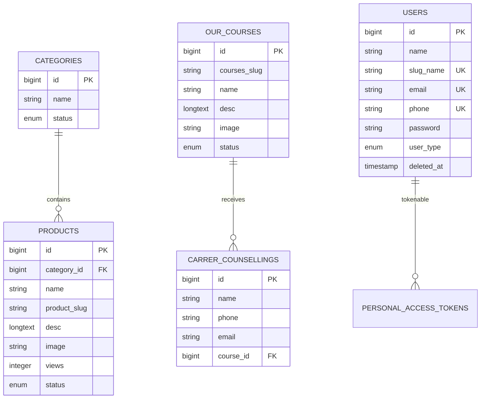

# MAAC Durgapur Project Map

Last reviewed: June 18, 2026  
Project root: `C:\xampp\htdocs\maacdurgapur`

## 1. Purpose

This repository contains the public website and custom content-management panel
for MAAC Durgapur and its related education brands.

The application is primarily responsible for:

- Presenting institute, course, placement, showcase, blog, and FAQ content.
- Capturing career-counselling leads.
- Allowing administrators to maintain selected content and media.
- Allowing administrators to review captured counselling enquiries.

It is a server-rendered Laravel monolith. There is no separate frontend
application, public registration flow, student portal, payment system, or
substantial external API.

## 2. Current Engineering Status

The application has a recognizable Laravel structure and a substantial public
frontend, but it is not currently production-ready.

The highest-risk condition is its deployment layout: the repository root is
being served by Apache instead of exposing only `public/`. In the reviewed local
configuration, sensitive and internal files were directly addressable over
HTTP. Treat deployment hardening, secret rotation, and private-document
protection as prerequisites for public release.

Other significant concerns include:

- Laravel 9 is end-of-life.
- The locked framework version is `9.52.16`.
- Debug/local settings are active in the reviewed environment.
- Several routes reference missing views or incomplete controller methods.
- Frontend asset URLs do not work correctly with the current subdirectory
  document-root configuration.
- Admin modules are partially implemented and contain copied or stale routes.
- Automated test coverage is effectively absent.

Do not copy credentials, personal data, database rows, or uploaded private
documents into this file.

## 3. Technology Stack

### Backend

| Concern | Technology |
|---|---|
| Language | PHP 8.x |
| Framework | Laravel 9.52.16 |
| ORM | Eloquent |
| Database | MySQL / InnoDB |
| Authentication | Laravel `web` session guard |
| API authentication | Laravel Sanctum, installed but largely unused |
| Image handling | Intervention Image 2.7 |
| HTTP client | Guzzle 7 |
| Queue | Synchronous |
| Cache | File |
| Session | File |
| Mail | Configured through Laravel; reviewed environment uses the log mailer |

### Frontend

| Concern | Technology |
|---|---|
| Rendering | Blade templates |
| Core JavaScript | Vanilla JavaScript |
| Admin JavaScript | jQuery |
| Admin theme | AdminLTE / Bootstrap 4 |
| Animation | GSAP, ScrollTrigger, Three.js, custom canvas effects |
| Carousels | Swiper; Owl Carousel assets also exist |
| Admin tables | DataTables |
| Rich text | Summernote |
| Notifications | SweetAlert2 and Toastr |
| Build tool | Vite 4 |
| Package managers | Composer and npm |

The active public pages load CSS and JavaScript directly from
`public/frontend/`; they do not meaningfully use the configured Vite entry
points.

## 4. Repository Structure

```text
maacdurgapur/
├── app/
│   ├── Exceptions/             Global Laravel exception handler
│   ├── Helper/admin/           Site, course, social-link, and upload helpers
│   ├── Http/
│   │   ├── Controllers/
│   │   │   ├── Admin/          Admin content-management controllers
│   │   │   ├── Course/         Course CRUD and lead-list controller
│   │   │   └── Web/            Public pages and counselling submission
│   │   ├── Middleware/         Auth, admin guard, CSRF, profiler, cache headers
│   │   └── Kernel.php          HTTP middleware registration
│   ├── Mail/                   Counselling-notification Mailable
│   ├── Models/                 Eloquent models
│   └── Providers/              App, auth, event, and route providers
├── bootstrap/
│   ├── app.php                 Laravel bootstrap
│   └── cache/                  Generated service/package caches
├── config/                     Laravel configuration
├── database/
│   ├── factories/
│   ├── migrations/             Database schema history
│   └── seeders/                Initial admin and CMS data
├── lang/                       Laravel validation/auth language files
├── loader/                     Loading GIF assets
├── public/
│   ├── admin/                  AdminLTE and vendored admin plugins
│   ├── frontend/               Public CSS, JS, images, fonts, and videos
│   ├── upload/                 Public media and archive files
│   └── index.php               Laravel HTTP front controller
├── resources/
│   ├── css/ and js/            Minimal Vite entry points
│   └── views/
│       ├── admin/              Admin layouts and CRUD pages
│       ├── emails/             Mail templates
│       ├── errors/             Error views
│       └── frontend/           Public layouts and pages
├── routes/
│   ├── admin.php               Admin login and CMS routes
│   ├── api.php                 Minimal Sanctum API route
│   ├── channels.php
│   ├── console.php
│   └── web.php                 Public website routes
├── storage/                    Logs, sessions, cache, and compiled views
├── tests/                      Placeholder unit and feature tests
├── upload/                     A second upload tree outside `public/`
├── vendor/                     Composer-installed packages
├── node_modules/               npm-installed packages
├── .env                        Active local environment; never expose or commit
├── .htaccess                   Root-level Apache rewrite rules
├── artisan                     Laravel console entry point
├── composer.json
├── db_dump.sql                 Sensitive database dump; not application source
├── index.php                   Development/root front-controller shim
├── package.json
└── vite.config.js
```

### Directory notes

- `public/` should be the only web-accessible document root.
- `upload/` and `public/upload/` contain overlapping media trees. Their intended
  ownership is not consistently defined.
- `vendor/`, `node_modules/`, generated caches, SQL dumps, and uploaded user
  documents should not be deployed as publicly readable application content.
- Several administrative plugins are vendored directly under `public/admin`.

## 5. Application Entry Points and Lifecycle

### HTTP entry points

- `public/index.php`: canonical Laravel front controller.
- Root `index.php`: development-style shim that forwards to `public/index.php`.
- Root `.htaccess`: rewrites unresolved requests to the root front controller.

### Console entry point

- `artisan`

### Request lifecycle

```text
Web server
  → public/index.php
  → Composer autoloader
  → bootstrap/app.php
  → App\Http\Kernel
  → global middleware
  → web or api middleware group
  → route
  → controller
  → Eloquent/MySQL
  → Blade or JSON response
  → terminating request profiler
```

### Global middleware

Registered in `app/Http/Kernel.php`:

- `RequestProfilerMiddleware`
- `TrustProxies`
- `PreventRequestsDuringMaintenance`
- Laravel post-size validation
- `TrimStrings`
- conversion of empty strings to `null`

`TrustHosts` and CORS middleware are currently disabled in the global stack.

### Web middleware

- Cookie encryption
- Queued cookies
- Session startup
- Shared validation errors
- CSRF validation
- Route bindings

### API middleware

- API rate limiter
- Route bindings

## 6. Route Map

### Public web routes

| Method | URI | Name | Handler | Notes |
|---|---|---|---|---|
| GET | `/` | `home` | `PageController@index` | Homepage |
| GET | `/maac` | `maac` | `PageController@maac` | MAAC landing page |
| GET | `/aksha` | `aksha` | `PageController@aksha` | Minimal page; missing page assets |
| GET | `/space-e-fic` | `space_e_fic` | `PageController@space_e_fic` | Minimal page; missing page assets |
| GET | `/fcq` | `fcq` | `PageController@fcq` | FAQ/course-question page |
| GET | `/showcase` | `showcase` | `PageController@showcase` | Student work |
| GET | `/blog` | `blog` | `PageController@blog` | Static blog page |
| GET | `/faq` | `faq` | `PageController@faq` | FAQ |
| GET | `/web-design-ui-ux-course` | `web` | `PageController@web` | References missing view |
| GET | `/motion-graphics` | `motion` | `PageController@motion` | References missing view |
| POST | `/career-counselling` | `career_counselling` | `PageController@counselling` | Lead capture |
| GET | `/terms-and-condition` | `terms_and_condition` | `PageController@terms` | Terms page |

The public route file also contains unauthenticated cache/config Artisan routes.
These are operational hazards and must not exist in production.

### Authentication routes

| Method | URI | Name | Handler |
|---|---|---|---|
| GET | `/admin-login` | `admin_login` | `AdminLoginController@admin_login_page` |
| POST | `/admin-login-check` | `admin_login_check` | `AdminLoginController@admin_login_check` |

### Protected admin group

Prefix: `/v1/cpanel/admin`  
Name prefix: `admin::`  
Middleware: `web`, `AdminMiddleware`, `revalidate`

Routed modules:

- Dashboard
- Profile and password update
- Site information
- CMS headings
- Contact information
- Banners
- About content
- Courses
- Testimonials
- Services
- Counselling lead listing

Controllers and views also exist for products, careers, subscribers, and team
members, but their routes are absent or incomplete.

### API routes

| Method | URI | Middleware | Purpose |
|---|---|---|---|
| GET | `/api/user` | `auth:sanctum` | Default authenticated-user endpoint |

No API token-issuance flow or material REST API is implemented.

## 7. Public Frontend Map

### Shared layout

`resources/views/frontend/layout/app.blade.php` contains:

- Document metadata and asset tags
- Site loader
- Desktop navigation
- Mobile overlay navigation
- Footer
- Counselling modal
- Rule-based chatbot
- Shared animation and interaction scripts

### Homepage

`resources/views/frontend/pages/index.blade.php` is a standalone full HTML
document rather than a child of the shared layout. It duplicates much of the
layout and contains:

- Hero section
- Institute/brand sections
- Dynamic course carousel
- Statistics
- Recruiter ticker
- Placement cards
- Student journey/showcase sections
- AI marketing section
- Footer
- Counselling modal
- Chatbot
- Loader logic

Because the homepage and shared layout duplicate large blocks, changes must
currently be made in more than one place.

### Page-specific templates

| Template | Main responsibility |
|---|---|
| `maac.blade.php` | Detailed MAAC campaign page and enquiry form |
| `aksha.blade.php` | Placeholder/minimal AKSHA page |
| `space_e_fic.blade.php` | Placeholder/minimal Space-E-Fic page |
| `fcq.blade.php` | Expandable question/answer page |
| `faq.blade.php` | FAQ page |
| `showcase.blade.php` | Student-work showcase |
| `blog.blade.php` | Static blog/article cards |
| `t_and_c.blade.php` | Terms and conditions |

`web.blade.php` and `motion.blade.php` are referenced by controllers but are
missing.

### Frontend JavaScript responsibilities

| File | Responsibility |
|---|---|
| `public/frontend/js/main.js` | Swipers, navigation, mobile menu, image handling |
| `animations.js` | GSAP and ScrollTrigger page animation |
| `sakura.js` | Canvas-based visual effects |
| `counselling-modal.js` | Modal lifecycle, validation, custom select, AJAX |
| `chatbot.js` | Hardcoded chatbot answers and embedded lead form |
| `maac.js` | MAAC page animation and AJAX enquiry flow |
| `fcq.js` | Accordion behavior |

The chatbot is not connected to an AI provider. Its system prompt is unused and
its answers are selected from hardcoded keyword checks.

### Asset strategy

- Main assets are served directly from `public/frontend`.
- Dynamic course images are stored as database path strings.
- Admin uploads are moved into relative `upload/...` directories.
- External scripts/styles are loaded from Google Fonts and CDNs.
- The homepage preloads its hero image and lazy-loads many other images.
- Vite output is not used by the main public/admin pages.

### Known frontend defects

- Asset URLs omit `/public` in the reviewed XAMPP subdirectory deployment.
- Database course image paths use Windows backslashes.
- The chatbot hardcodes `/career-counselling`, ignoring an application
  subdirectory.
- Numerous navigation links are placeholders using `href="#"`.
- Some source text contains mojibake/encoding artifacts.
- Several large animations run continuously.
- FAQ CSS uses a time-based cache-buster.
- AKSHA and Space-E-Fic reference missing CSS/JavaScript files.

## 8. Backend Map

### Public controller

`App\Http\Controllers\Web\PageController`

Responsibilities:

- Load active courses and testimonials for public pages.
- Load the first banner for the homepage.
- Render static marketing pages.
- Validate and save counselling requests.

Counselling submission flow:

```text
POST career-counselling
  → validate name, phone, email, course_id
  → insert CarrerCounselling
  → load selected OurCourse
  → return JSON success or validation errors
```

The selected course name is loaded but unused. `AdminNotification` and `Mail`
are imported but no mail is sent.

### Admin controllers

| Controller | Responsibility |
|---|---|
| `AdminLoginController` | Session-based admin login |
| `DashboardController` | Static admin dashboard |
| `ProfileController` | Profile, password, and logout |
| `SiteInformationController` | Key/value site settings |
| `CmsController` | CMS heading/content entries |
| `ContactInfoController` | Contact-information editing |
| `BannerController` | Banner CRUD and status |
| `AboutPageController` | About-content editing and status |
| `CourseController` | Course CRUD and counselling lead listing |
| `TestimonialController` | Testimonial CRUD and status |
| `ServiceController` | Service CRUD and status |
| `ProductController` | Product CRUD; not routed in current admin map |
| `CareerController` | Career/applicant CRUD; not routed in current admin map |
| `SubscriberController` | Subscriber management; not routed |
| `TeamMamebrController` | Team management; not routed and misspelled |

### Architectural characteristics

- Controllers directly query and mutate Eloquent models.
- No service, repository, action, DTO, or domain layer exists.
- Validation is performed inline in controllers.
- File storage and database updates are not transactional.
- Most model lookups use `first()` without null handling.
- Models contain almost no behavior or relationships.

### Helpers

| Helper | Responsibility | Important behavior |
|---|---|---|
| `ImageUpload` | Save, resize, update, delete images | Uses relative paths and suppressed unlink failures |
| `siteInformation` | Load site settings and course names | Performs repeated queries and causes an N+1 lead lookup |
| `GetTeamProfileLink` | Derive social profile identifiers | Uses fragile string splitting |

### Events, jobs, policies, services

- No application jobs are implemented.
- No meaningful application events/listeners are implemented.
- No policies or custom gates are configured.
- No application service layer is present.
- The queue connection is synchronous.

## 9. Authentication and Authorization

### Login flow

```text
GET admin-login
  → login Blade page
POST admin-login-check
  → validate email/password
  → Auth::attempt(email, password, user_type=Admin)
  → JSON status
  → browser redirects to dashboard
```

### Admin authorization

`AdminMiddleware` allows the request only when:

- An authenticated session user exists.
- `users.user_type` equals `Admin`.

There are no granular roles or permissions. Every administrator can access
every routed admin operation.

### Session behavior

- Default `web` guard with Eloquent users.
- File-backed sessions.
- Two-hour default lifetime in the reviewed environment.
- Session encryption disabled.
- HTTP-only and `SameSite=Lax` cookies.
- Secure-cookie behavior depends on environment configuration.

### Authentication gaps

- No login throttle.
- No account lockout.
- No MFA.
- No password-reset user interface.
- No session regeneration explicitly performed after login.
- Logout is a GET operation and does not explicitly invalidate the session or
  regenerate the CSRF token.
- A weak default administrator credential exists in the seeder and must never
  be used outside disposable development databases.

## 10. Admin Panel Map

### Layout

`resources/views/admin/layout/admin_layout.blade.php` loads:

- AdminLTE
- Bootstrap 4
- jQuery and jQuery UI
- DataTables
- Chart.js
- Summernote
- SweetAlert2
- Toastr
- Validation Engine
- Date/time and scrolling plugins

`leftmenu.blade.php` currently displays:

- Dashboard
- Banner
- Courses
- About
- Users Details
- Testimonials
- Contact Info

### CRUD pattern

Most modules use:

```text
index page
  → AJAX modal for add/edit form
  → POST save/update
  → AJAX status toggle
  → GET deletion followed by page reload
```

### Known admin defects

- `CmsController::index()` expects `$key`, while its route supplies no value.
- `CmsController::status()` is routed but not implemented.
- The controller expects `admin.pages.meta_data.index`, which does not exist.
- Several views reference route names not declared in `routes/admin.php`.
- The lead list deletes through the testimonial delete route.
- Course pages reuse `team_member` view paths and stale labels.
- Status AJAX handlers return manually generated HTML.
- Multiple modules contain copy/paste labels and action references from other
  modules.
- The dashboard has no material reporting or analytics.

## 11. Data Model

### Entity relationship overview



### Business tables

| Table | Model | Purpose |
|---|---|---|
| `users` | `User` | Administrators and potential future user types |
| `site_info` | `SiteInformationModel` | Site key/value settings |
| `cms` | `Cms` | Reusable heading/content records |
| `banners` | `Banner` | Homepage/banner media |
| `about_pages` | `AboutPage` | About/process content |
| `team_members` | `TeamMember` | Team profiles |
| `testimonials` | `Testimonial` | Student/client testimonials |
| `contact_infos` | `ContactInfo` | Address, email, phone, website |
| `subscribers` | `Subscriber` | Newsletter subscribers |
| `services` | `Service` | Service content |
| `contact_us` | `ContactUs` | General contact submissions |
| `categories` | `Category` | Product categories |
| `products` | `Product` | Product/course-like legacy content |
| `apply_nows` | `ApplyNow` | Career applicant data and documents |
| `careers` | `Career` | Open career records |
| `our_courses` | `OurCourse` | Publicly displayed courses |
| `carrer_counsellings` | `CarrerCounselling` | Counselling leads |

### Framework tables

- `migrations`
- `password_resets`
- `failed_jobs`
- `personal_access_tokens`

### Enforced relationships

- `products.category_id → categories.id`
- `carrer_counsellings.course_id → our_courses.id`
- Sanctum's polymorphic token relationship

Both business foreign keys use cascading updates and deletes. Deleting a course
will delete associated counselling leads.

### Data integrity concerns

- Models do not declare Eloquent relationships.
- `site_info.key` is not unique and duplicate keys exist in the reviewed dump.
- `our_courses.courses_slug` and `products.product_slug` are not unique.
- Subscriber email is nullable and non-unique.
- Many columns are nullable even when controllers require values.
- Status enums declare `InActive`, while controllers frequently write
  `Inactive`.
- Rollback methods for the product slug and applicant email migrations do not
  remove their columns.
- Common status and lead-search fields have few supporting indexes.

## 12. Security and Privacy Baseline

### Confirmed exposure in the reviewed deployment

The current document-root configuration allowed direct HTTP access to:

- `.env`
- `db_dump.sql`
- `composer.json`
- uploaded CV PDFs
- public archive files

Assume credentials and secrets from any exposed environment file may be
compromised. Assume personal data from the dump and uploaded documents may have
been exposed. Remediation should include containment, credential rotation, log
review, and an appropriate privacy-incident assessment.

### Existing positive controls

- Eloquent parameter binding avoids ordinary SQL injection in reviewed queries.
- Web POST routes use Laravel CSRF middleware.
- Passwords use Laravel hashing.
- Admin routes use an authentication/user-type middleware.
- Blade escapes most rendered values by default.

### Principal security gaps

- Project root exposed as the web root.
- Debug/local mode active.
- Public maintenance/cache/config routes.
- End-of-life framework and stale dependencies.
- No login or public-form throttling.
- Weak upload validation in several controllers.
- Original client filename retained by course uploads.
- Uploads stored beneath web-accessible paths.
- Mutating delete/logout actions use GET.
- Unescaped CMS HTML is rendered with `{!! !!}`.
- No HTML sanitization policy.
- Query profiler logs SQL bindings, which may include personal information.
- No security headers or formal content-security policy.
- No administrative audit log.

## 13. Performance and Scalability Baseline

### Database/query concerns

- Admin lists use unbounded `all()`/`get()` calls.
- Counselling lead listing performs one course lookup per row.
- Site-information rendering performs four independent queries per helper call.
- No eager loading because models define no relationships.
- No application-level caching for mostly static site content.

### Frontend concerns

- Custom frontend CSS is roughly 300 KB.
- Custom frontend JavaScript is roughly 240 KB.
- Several PNG backgrounds are larger than 2 MB.
- Multiple canvas/GSAP effects may run simultaneously.
- A site loader can delay access for up to four seconds.
- External CDN assets have no local fallback.
- The homepage and shared layout duplicate substantial markup and scripts.

### Scaling limitations

- File-backed sessions and cache.
- Synchronous queue.
- Local filesystem uploads.
- No object storage or CDN.
- No stateless deployment design.
- No worker or scheduler deployment configuration.
- No centralized monitoring or logging integration.

## 14. Error Handling and Observability

### Current behavior

- Laravel's default exception handler is largely unchanged.
- Some controllers catch generic `Exception` and return a generic flash message.
- Most failed lookups can become null-property errors.
- There are no domain-specific exceptions or error response contracts.

### Profiling

`RequestProfilerMiddleware`:

- Measures total request time.
- Logs requests slower than two seconds.
- Adds a compact stack trace above three seconds.
- Records query count and peak memory.

`AppServiceProvider`:

- Counts SQL queries.
- Logs queries slower than 500 ms.
- Includes SQL bindings in logs.

Binding logging should be reviewed because lead and account values may be
written to application logs.

## 15. Testing Status

Current tests:

- One unit test asserting `true`.
- One feature test asserting `/` returns HTTP 200.

There is no meaningful coverage for:

- Authentication
- Authorization
- Counselling validation and persistence
- Admin CRUD
- Upload security
- Status changes
- Deletion behavior
- Route/view completeness
- Database relationships
- API authentication
- Frontend interaction

No CI configuration was found.

## 16. Deployment Model

### Evidence

- Root `.htaccess` includes a cPanel-generated PHP 8.1 LSAPI handler.
- Local development is under XAMPP at `/maacdurgapur`.
- Root requests are forwarded through a shim to Laravel's public entry point.

### Required runtime services

- Apache or another PHP-capable web server
- PHP compatible with the selected Laravel version
- MySQL
- Composer dependencies
- Writable `storage/` and `bootstrap/cache/`
- Optional Node/npm for frontend builds

### Correct target deployment shape

```text
private application directory/
├── app
├── bootstrap
├── config
├── database
├── resources
├── routes
├── storage
├── vendor
└── .env

public web document root/
├── index.php
├── frontend
├── admin
├── approved public media
└── other explicitly public assets
```

The web server must expose only the public directory. Private applicant
documents should be stored outside it and delivered through authorized
controller responses.

### Missing operational capabilities

- CI/CD pipeline
- Deployment script
- Rollback procedure
- Environment runbook
- Backup/restore runbook
- Scheduler configuration
- Queue worker configuration
- Health check
- Central monitoring and alerting

## 17. Repository Hygiene

At the time of review, the Git working tree already contained user changes in:

- `public/frontend/css/style.css`
- `public/frontend/vedio/waterfall_desktop.mp4`
- `resources/views/frontend/pages/index.blade.php`

Do not overwrite or revert those changes without explicit review.

Other hygiene concerns:

- `db_dump.sql` is tracked.
- Uploaded personal documents are tracked.
- Generated Bootstrap cache files are tracked.
- Public media archives are tracked.
- The README is the default Laravel README.
- The repository contains utility scripts unrelated to normal Laravel runtime.

## 18. Known Broken or Incomplete Areas

Use this as a regression checklist:

1. Root document configuration exposes private files.
2. Public asset URLs fail under the reviewed XAMPP subdirectory deployment.
3. `/web-design-ui-ux-course` references a missing view.
4. `/motion-graphics` references a missing view.
5. AKSHA page assets are missing.
6. Space-E-Fic page assets are missing.
7. CMS index view is missing.
8. CMS index method signature does not match its route.
9. CMS status route targets a nonexistent method.
10. Product, career, subscriber, and team routes are missing/incomplete.
11. Multiple admin views reference undefined route names.
12. Lead deletion references testimonial deletion.
13. Status spelling differs between schema and controllers.
14. Course image paths contain Windows separators.
15. Chatbot submission uses a hardcoded root-relative URL.
16. Mail notification code exists but is not invoked.
17. Public cache/config routes are duplicated or misleadingly named.
18. Delete and logout endpoints use GET.
19. Upload path/delete handling is inconsistent.
20. The admin dashboard has no real metrics.

## 19. Recommended Remediation Sequence

### Phase 0: Emergency containment

1. Point the document root to `public/`.
2. Block access to dotfiles, SQL, source metadata, lock files, and archives.
3. Remove private uploads and database dumps from public access.
4. Rotate exposed application, database, mail, and integration credentials.
5. Disable debug mode.
6. Remove public Artisan routes.

### Phase 1: Security stabilization

1. Upgrade Laravel and other vulnerable dependencies.
2. Add login and public-form rate limiting.
3. Regenerate sessions on login and invalidate them on logout.
4. Convert mutating GET endpoints to proper protected methods.
5. Harden upload validation and storage.
6. Add a CMS HTML sanitization policy.
7. Add secure-cookie and response-header configuration.

### Phase 2: Functional repair

1. Correct document-root and asset URL behavior.
2. Implement or remove missing public pages.
3. Repair CMS routes, methods, and views.
4. Reconcile orphaned admin modules.
5. Normalize status values.
6. Fix invalid route references and deletion targets.
7. Add explicit not-found handling.

### Phase 3: Architecture and performance

1. Define model relationships.
2. Add eager loading and pagination.
3. Introduce Form Request validation.
4. Extract repeated application services/actions.
5. Cache stable content.
6. Move uploads to controlled storage.
7. Queue mail and background work.
8. Consolidate duplicated Blade layout code.
9. Optimize media and animation execution.

### Phase 4: Production engineering

1. Add feature, security, and regression tests.
2. Add CI, dependency auditing, and coding-standard checks.
3. Document deployment and rollback.
4. Test backup and restoration.
5. Add structured monitoring and alerts.
6. Establish privacy retention and deletion policies.

## 20. Development Conventions for Future Work

Until the architecture is improved, follow these constraints:

- Preserve existing user changes and inspect `git status` before editing.
- Never commit `.env`, database dumps, credentials, or personal documents.
- Store private files outside the public document root.
- Use named routes rather than hardcoded application-root URLs.
- Use forward-slash storage paths independent of the operating system.
- Use Form Request classes for new validation.
- Use `findOrFail()` or explicit null handling for resource lookups.
- Use transactions when a workflow combines database and file mutations.
- Use Eloquent relationships and eager loading instead of helper queries.
- Paginate admin collections.
- Use POST/PATCH/DELETE for mutations and retain CSRF protection.
- Sanitize rich HTML before storage or before unescaped rendering.
- Add tests alongside every repaired or newly introduced business flow.
- Avoid adding another copied CRUD controller; extract a coherent reusable
  pattern when touching multiple modules.
- Prefer Blade components/partials for shared navigation, footer, forms, and
  modals.

## 21. Useful Commands

Read-only discovery:

```powershell
php artisan route:list
php artisan about
git -c safe.directory=C:/xampp/htdocs/maacdurgapur status --short --branch
rg --files -g '!vendor/**' -g '!node_modules/**'
```

Validation commands to use after future approved changes:

```powershell
php artisan test
php artisan route:list
php artisan config:show app
composer audit
cmd /c npm audit
cmd /c npm run build
```

Do not run migration, seeding, cache mutation, dependency update, or destructive
Git commands against a shared or production environment without explicit
approval and a verified backup.

## 22. Key File Index

| Area | File |
|---|---|
| Public routes | `routes/web.php` |
| Admin routes | `routes/admin.php` |
| API routes | `routes/api.php` |
| Route registration | `app/Providers/RouteServiceProvider.php` |
| HTTP middleware | `app/Http/Kernel.php` |
| Public controller | `app/Http/Controllers/Web/PageController.php` |
| Admin login | `app/Http/Controllers/Admin/Login/AdminLoginController.php` |
| Admin access check | `app/Http/Middleware/AdminMiddleware.php` |
| Course/lead admin | `app/Http/Controllers/Course/CourseController.php` |
| Upload helper | `app/Helper/admin/ImageUpload.php` |
| Site helper | `app/Helper/admin/siteInformation.php` |
| Shared frontend layout | `resources/views/frontend/layout/app.blade.php` |
| Homepage | `resources/views/frontend/pages/index.blade.php` |
| Admin layout | `resources/views/admin/layout/admin_layout.blade.php` |
| Admin navigation | `resources/views/admin/layout/leftmenu.blade.php` |
| Frontend core CSS | `public/frontend/css/style.css` |
| Frontend core JS | `public/frontend/js/main.js` |
| Counselling JS | `public/frontend/js/counselling-modal.js` |
| Chatbot JS | `public/frontend/js/chatbot.js` |
| Database migrations | `database/migrations/` |
| Dependency definitions | `composer.json`, `package.json` |
| Apache rules | `.htaccess` |

## 23. Scope and Confidence

This map was created through:

- Full repository inventory excluding dependency internals where appropriate.
- Route, controller, middleware, model, migration, seeder, view, CSS, and
  JavaScript inspection.
- Database-dump schema inspection without reproducing private row contents.
- Read-only local HTTP checks.
- Read-only browser checks at desktop, tablet, and mobile viewport sizes.
- Git status and tracked-file inspection.

Runtime findings are specific to the reviewed local XAMPP/subdirectory
configuration unless explicitly described as code-level defects.
