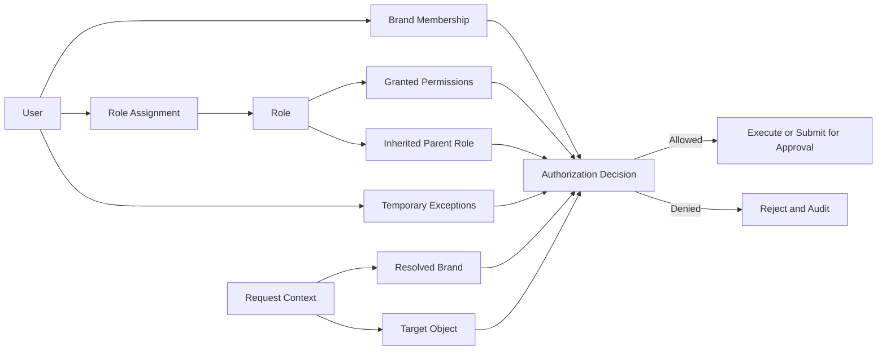
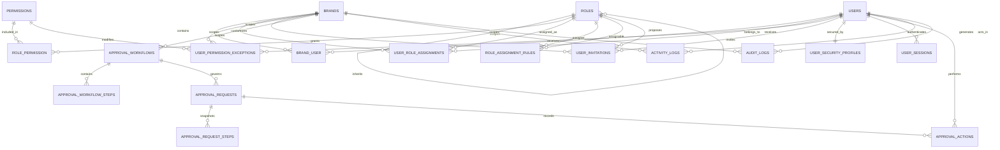

# Role-Based Access Control Architecture

**Project:** MAAC Durgapur Multi-Brand CMS  
**Document type:** Architecture proposal  
**Status:** Awaiting approval  
**Prepared:** 19 June 2026  
**Scope:** Authorization, user administration, approval workflows, activity logs, and audit logs

## 1. Purpose

This document defines a complete Role-Based Access Control system for the
multi-brand Laravel CMS serving:

- MAAC
- AKSHA
- Space-E-Fic

The architecture must ensure that:

- Users access only authorized modules and brands.
- Permissions are enforced on the server, not only hidden in navigation.
- High-risk actions require explicit approval where configured.
- Privilege changes are traceable and reversible.
- Administrative activity produces useful operational history.
- Security-sensitive actions produce immutable audit evidence.
- Future CMS, CRM, analytics, and reporting modules can reuse the same model.

This is an architecture document only. It does not authorize code, migrations,
seeding, package installation, configuration changes, or data modification.

## 2. Security Principles

### 2.1 Deny by default

A user has no access unless an active role assignment or approved temporary
exception grants it.

### 2.2 Server-side authorization

Navigation visibility improves usability but is never an authorization
boundary. Controllers, actions, policies, queries, downloads, API endpoints,
and background operations must enforce authorization independently.

### 2.3 Brand scope is part of every decision

Permission answers both:

1. What may this user do?
2. For which brand may the user do it?

Possessing `content.pages.edit` for MAAC must not grant the same capability for
AKSHA or Space-E-Fic.

### 2.4 Least privilege

Users receive the minimum permissions and brand scope required for their work.
Broad global assignments are exceptional.

### 2.5 Separation of duties

Where practical, the user who creates a sensitive change should not be the
only user who approves and publishes it.

### 2.6 Explicit permissions

Super Admin is represented by explicit global permissions. Authorization must
not depend on a hardcoded user ID, email address, or unconditional bypass.

### 2.7 No silent privilege escalation

Users cannot:

- Assign roles more privileged than their delegated authority
- Add themselves to brands they do not manage
- Approve their own restricted role elevation
- Alter or delete audit evidence
- Convert a brand-scoped assignment into global access

### 2.8 Time-bound exceptional access

Temporary access must have:

- A reason
- An approver
- Start and expiry times
- A narrow permission and brand scope
- Audit records

### 2.9 Stable permission identifiers

Permission codes are immutable application contracts. Labels may change;
permission keys must not.

## 3. Authorization Model

The model combines:

- Role-Based Access Control for normal permissions
- Brand-scoped assignments for tenancy boundaries
- Permission inheritance for maintainable roles
- Temporary exceptions for exceptional access
- Approval policies for high-risk operations
- Object-level checks for ownership, status, and record sensitivity



## 4. Scope Types

### 4.1 Global scope

An assignment with global scope may act across all current and future brands,
subject to its permissions.

Global scope is reserved for tightly controlled platform roles such as:

- Super Admin
- Security Administrator
- Platform Auditor
- Platform Support with limited permissions

### 4.2 Brand scope

A brand-scoped assignment applies to exactly one brand:

- MAAC
- AKSHA
- Space-E-Fic

Most operational users should be brand-scoped.

### 4.3 Multi-brand scope

A user requiring access to two brands receives two explicit brand assignments.
The system should not store a comma-separated or JSON list of brands in a role
assignment.

### 4.4 Record scope

Some modules need an additional object-level rule:

- Own drafts only
- Assigned leads only
- Records created by the user's team
- Private media with a documented business purpose
- Records in a permitted workflow state

Record scope supplements RBAC. It does not replace brand authorization.

## 5. Core Roles

### 5.1 Super Admin

Platform-wide administrator with explicit global permissions.

Core responsibilities:

- Manage brands and brand domains
- Manage the permission catalogue
- Create and manage roles
- Assign global administrative roles
- Manage all brand memberships
- Manage approval policies
- View platform-wide activity and audit logs
- Manage security policy
- Initiate emergency access procedures
- Manage shared media and global settings

Restrictions:

- MFA required
- Sensitive actions require re-authentication
- Cannot erase audit logs
- Private files remain purpose-controlled and audited
- Emergency overrides require a reason

### 5.2 Brand Admin

Administrative owner for one assigned brand.

Core responsibilities:

- Manage users within the assigned brand
- Assign approved brand-level roles
- Manage brand settings
- Publish brand content where permitted
- Manage brand media
- Configure brand workflows from approved templates
- View brand activity and non-restricted audit records
- Approve routine content publication

Restrictions:

- Cannot create global roles
- Cannot assign Super Admin or platform permissions
- Cannot access other brands
- Cannot change the permission catalogue
- Cannot access private files without a separate permission
- Cannot weaken platform security controls
- Cannot approve their own privilege elevation

### 5.3 Content Manager

Senior content operator for one or more assigned brands.

Core responsibilities:

- Manage content across approved CMS modules
- Assign work to editors
- Review drafts
- Submit or approve publication according to workflow
- View content activity reports
- Attach approved media

### 5.4 Content Editor

Creates and edits content within assigned brands.

Core responsibilities:

- Create drafts
- Edit permitted draft content
- Upload permitted public media
- Attach existing media
- Submit content for review
- View status and reviewer feedback

Restrictions:

- Cannot publish unless explicitly granted
- Cannot approve their own restricted submission
- Cannot manage users, roles, or permissions
- Cannot edit global settings
- Cannot purge media
- Cannot view private CRM or applicant information

### 5.5 Media Manager

Manages the media library for assigned brands.

Core responsibilities:

- Upload and process media
- Edit metadata, alt text, credits, folders, and tags
- Manage approved public media
- Replace media with impact review
- Archive and restore media
- Review failed processing operations
- Manage brand media quotas where permitted

Restrictions:

- Cannot publish unrelated CMS content
- Cannot access private documents without a separate permission
- Cannot purge media unless separately delegated
- Cannot promote assets to the shared library without approval

### 5.6 Reviewer / Publisher

Performs independent content review.

Core responsibilities:

- Review submitted content and settings
- Request changes
- Approve or reject publication
- Publish approved content where delegated
- Review media-rights and accessibility requirements

### 5.7 Analyst

Read-only access to approved dashboards, analytics, and reports.

Restrictions:

- No content mutation
- No user administration
- No raw private lead exports unless separately approved

### 5.8 Auditor

Read-only access to activity, audit evidence, approval history, and selected
security reports.

Restrictions:

- Cannot change operational data
- Cannot manage roles
- Cannot download private media by default
- Sensitive values remain redacted

### 5.9 Future CRM roles

- CRM Manager
- CRM Agent
- Lead Reviewer
- CRM Analyst

These roles use the same brand-scoped assignment model and are described in
Section 25.

### 5.10 Student Counsellor

Brand-scoped operational role responsible for counselling leads and prospective
student follow-up.

Core responsibilities:

- View leads assigned to the counsellor
- Create and update permitted lead information
- Record calls, emails, WhatsApp interactions, meetings, and notes
- Schedule and complete follow-ups
- Update permitted pipeline stages
- View course information needed for counselling
- Create leads received through authorized offline channels
- View personal performance and follow-up dashboards

Restrictions:

- Cannot view unassigned leads unless separately granted
- Cannot bulk export lead data
- Cannot delete lead or communication history
- Cannot change lead brand
- Cannot assign leads to other counsellors by default
- Cannot access placement records, global settings, RBAC, or audit logs
- Cannot publish website content

### 5.11 Placement Coordinator

Brand-scoped role responsible for placement outcomes, recruiters, student
placement records, and public placement content.

Core responsibilities:

- Manage placement records for the assigned brand
- Manage recruiter/company records
- Upload and attach approved placement media
- Verify placement data and supporting evidence
- Create placement success-story drafts
- Submit placement content for review
- View placement reports
- Coordinate publication with a Reviewer or Publisher

Restrictions:

- Cannot publish placement claims without the required approval
- Cannot modify unrelated CMS modules
- Cannot access counselling leads unless separately granted
- Cannot expose private student documents as public media
- Cannot delete verified placement history without approval
- Cannot manage users or roles

### 5.12 Marketing Manager

Brand-scoped role responsible for campaigns, brand content, lead-source
configuration, and marketing performance.

Core responsibilities:

- Manage approved homepage and campaign content
- Manage CTA blocks, campaign labels, and marketing-oriented settings
- Manage SEO metadata when delegated
- View analytics and campaign reports
- View aggregated lead-source and conversion reports
- Manage approved tracking-event configuration
- Submit or approve marketing content according to workflow
- Coordinate public media with the Media Manager

Restrictions:

- Does not receive unrestricted lead personal data by default
- Cannot view private lead communications unless separately granted
- Cannot export raw lead data without a high-risk permission
- Cannot alter global platform settings
- Cannot manage roles or security policy
- Cannot publish legal or sensitive settings without approval

## 6. Permission Naming Convention

Permission codes use:

```text
domain.resource.action
```

Examples:

```text
content.pages.view
content.pages.create
content.pages.edit
content.pages.submit
content.pages.approve
content.pages.publish
content.pages.archive

media.assets.upload
media.assets.edit
media.assets.replace
media.assets.publish
media.assets.purge

settings.brand.edit
settings.brand.publish
settings.global.edit

users.accounts.invite
users.roles.assign
audit.logs.view
```

Rules:

- Lowercase only
- Dot-separated
- No brand names in permission keys
- No route names in permission keys
- No generic `manage_everything`
- Actions reflect business capabilities
- High-risk permissions are individually assignable

## 7. Permission Catalogue

### Platform and brand administration

- `brands.view`
- `brands.create`
- `brands.edit`
- `brands.archive`
- `brands.manage_domains`
- `brands.manage_members`
- `brands.access_global_scope`

### User management

- `users.accounts.view`
- `users.accounts.invite`
- `users.accounts.create`
- `users.accounts.edit`
- `users.accounts.suspend`
- `users.accounts.reactivate`
- `users.accounts.unlock`
- `users.accounts.reset_mfa`
- `users.accounts.end_sessions`
- `users.accounts.delete`
- `users.roles.view`
- `users.roles.assign`
- `users.roles.revoke`
- `users.temporary_access.grant`
- `users.temporary_access.revoke`

### Role and permission administration

- `rbac.roles.view`
- `rbac.roles.create`
- `rbac.roles.edit`
- `rbac.roles.archive`
- `rbac.roles.clone`
- `rbac.permissions.view`
- `rbac.permissions.manage`
- `rbac.assignments.view`
- `rbac.assignments.manage_global`
- `rbac.approval_policies.manage`

### Settings

- `settings.brand.view`
- `settings.brand.edit`
- `settings.brand.submit`
- `settings.brand.approve`
- `settings.brand.publish`
- `settings.brand.rollback`
- `settings.global.view`
- `settings.global.edit`
- `settings.global.publish`
- `settings.definitions.manage`
- `settings.sensitive.view`
- `settings.sensitive.edit`

### Media

- `media.assets.view`
- `media.assets.upload`
- `media.assets.edit_metadata`
- `media.assets.organize`
- `media.assets.attach`
- `media.assets.publish`
- `media.assets.replace`
- `media.assets.archive`
- `media.assets.restore`
- `media.assets.purge`
- `media.assets.manage_shared`
- `media.assets.classify`
- `media.private.view`
- `media.private.download`
- `media.processing.manage`

### CMS content

The following action family applies to pages, homepage sections, menus,
courses, testimonials, FAQs, blog posts, placements, and future modules:

- `view`
- `create`
- `edit`
- `edit_own`
- `submit`
- `review`
- `approve`
- `publish`
- `unpublish`
- `archive`
- `restore`
- `delete`
- `export`

Examples:

- `content.courses.edit`
- `content.blog.publish`
- `content.placements.approve`
- `content.menus.edit`

### SEO

- `seo.metadata.view`
- `seo.metadata.edit`
- `seo.metadata.approve`
- `seo.metadata.publish`
- `seo.redirects.manage`
- `seo.schema.manage`

### Animation and theme

- `animations.config.view`
- `animations.config.edit`
- `animations.config.approve`
- `animations.config.publish`
- `theme.settings.view`
- `theme.settings.edit`
- `theme.settings.publish`

### Leads and future CRM

- `crm.leads.view`
- `crm.leads.view_assigned`
- `crm.leads.create`
- `crm.leads.edit`
- `crm.leads.assign`
- `crm.leads.change_status`
- `crm.leads.export`
- `crm.leads.delete`
- `crm.communications.view`
- `crm.communications.create`
- `crm.communications.edit`
- `crm.communications.delete`
- `crm.followups.manage`
- `crm.reports.view`
- `crm.settings.manage`

Student Counsellor baseline permissions:

- `crm.leads.view_assigned`
- `crm.leads.create`
- `crm.leads.edit_assigned`
- `crm.leads.change_status_assigned`
- `crm.communications.view_assigned`
- `crm.communications.create`
- `crm.followups.manage_assigned`
- `crm.dashboard.view_own`

Placement permissions:

- `placements.records.view`
- `placements.records.create`
- `placements.records.edit`
- `placements.records.verify`
- `placements.records.submit`
- `placements.records.approve`
- `placements.records.publish`
- `placements.records.archive`
- `placements.recruiters.manage`
- `placements.evidence.view_private`
- `placements.reports.view`
- `placements.reports.export`

Marketing permissions:

- `marketing.campaigns.view`
- `marketing.campaigns.create`
- `marketing.campaigns.edit`
- `marketing.campaigns.submit`
- `marketing.campaigns.approve`
- `marketing.campaigns.publish`
- `marketing.ctas.manage`
- `marketing.lead_sources.manage`
- `marketing.analytics.view`
- `marketing.analytics.export`
- `marketing.tracking.manage`

### Analytics and reporting

- `analytics.dashboard.view`
- `analytics.events.view`
- `analytics.reports.view`
- `analytics.reports.export`
- `analytics.configuration.manage`

### Activity and audit

- `activity.logs.view_own`
- `activity.logs.view_brand`
- `activity.logs.view_global`
- `audit.logs.view_brand`
- `audit.logs.view_global`
- `audit.logs.export`
- `audit.private_access.view`
- `audit.security_events.view`

### Approval workflow

- `approvals.requests.view`
- `approvals.requests.submit`
- `approvals.requests.cancel_own`
- `approvals.requests.review`
- `approvals.requests.approve`
- `approvals.requests.reject`
- `approvals.requests.reassign`
- `approvals.requests.override`

## 8. Database Schema

The schema extends the approved multi-brand foundation:

- `users`
- `brands`
- `brand_user`

The RBAC tables below should not duplicate brand identity or user identity.

## 9. `roles`

Defines reusable roles.

| Column | Type | Purpose |
|---|---|---|
| `id` | bigint | Primary key |
| `uuid` | UUID | Stable external identifier |
| `parent_role_id` | bigint, nullable | Optional inherited role |
| `code` | varchar(100) | Immutable unique code |
| `name` | varchar(150) | Administrative label |
| `description` | text, nullable | Intended use |
| `scope_type` | varchar(30) | `global` or `brand` |
| `is_system` | boolean | Protected platform-defined role |
| `is_assignable` | boolean | Available for assignment |
| `risk_level` | varchar(20) | `low`, `medium`, `high`, `critical` |
| `status` | varchar(30) | `active`, `inactive`, `archived` |
| `created_by` | bigint, nullable | Creating user |
| `updated_by` | bigint, nullable | Last editor |
| `created_at` | timestamp | Audit timestamp |
| `updated_at` | timestamp | Audit timestamp |
| `deleted_at` | timestamp, nullable | Soft delete |

Constraints:

- Unique `uuid`
- Unique `code`
- A global role cannot inherit from a brand role
- Inheritance cycles are prohibited
- System roles cannot be deleted
- Assigned roles cannot be hard-deleted

## 10. `permissions`

Canonical permission catalogue.

| Column | Type | Purpose |
|---|---|---|
| `id` | bigint | Primary key |
| `code` | varchar(190) | Immutable unique permission key |
| `domain` | varchar(100) | Functional domain |
| `resource` | varchar(100) | Protected resource |
| `action` | varchar(100) | Business action |
| `name` | varchar(190) | Admin label |
| `description` | text, nullable | Security meaning |
| `scope_type` | varchar(30) | `global`, `brand`, or `either` |
| `risk_level` | varchar(20) | `low`, `medium`, `high`, `critical` |
| `requires_mfa` | boolean | Step-up requirement |
| `requires_reauthentication` | boolean | Fresh credential requirement |
| `is_delegable` | boolean | May lower roles assign it |
| `status` | varchar(30) | `active`, `deprecated`, `inactive` |
| `created_at` | timestamp | Audit timestamp |
| `updated_at` | timestamp | Audit timestamp |

Permission codes are application-owned. Normal administrators must not create
arbitrary permission codes from the UI.

## 11. `role_permission`

Assigns permissions to roles.

| Column | Type | Purpose |
|---|---|---|
| `id` | bigint | Primary key |
| `role_id` | bigint | Role foreign key |
| `permission_id` | bigint | Permission foreign key |
| `granted_by` | bigint, nullable | Granting user |
| `created_at` | timestamp | Grant timestamp |

Constraints:

- Unique `role_id`, `permission_id`
- Only grants are stored; absence means not granted
- Critical permission changes require approval

## 12. `user_role_assignments`

Connects a user to a role and scope.

| Column | Type | Purpose |
|---|---|---|
| `id` | bigint | Primary key |
| `uuid` | UUID | Stable assignment identifier |
| `user_id` | bigint | User foreign key |
| `role_id` | bigint | Role foreign key |
| `brand_id` | bigint, nullable | Required for brand roles; null for global |
| `status` | varchar(30) | `pending`, `active`, `suspended`, `expired`, `revoked` |
| `starts_at` | timestamp, nullable | Activation time |
| `expires_at` | timestamp, nullable | Expiry time |
| `assigned_by` | bigint, nullable | Assigning user |
| `approved_by` | bigint, nullable | Approver for sensitive assignment |
| `approved_at` | timestamp, nullable | Approval timestamp |
| `reason` | text, nullable | Business justification |
| `revoked_by` | bigint, nullable | Revoking user |
| `revoked_at` | timestamp, nullable | Revocation time |
| `revocation_reason` | text, nullable | Reason |
| `created_at` | timestamp | Audit timestamp |
| `updated_at` | timestamp | Audit timestamp |

Constraints:

- Unique active logical assignment per user, role, and brand
- Brand role requires `brand_id`
- Global role requires null `brand_id`
- Brand assignment requires active `brand_user` membership
- Expired assignments do not authorize
- Revoked records are retained for audit

## 13. `user_permission_exceptions`

Supports narrowly scoped, temporary grants or explicit denials.

| Column | Type | Purpose |
|---|---|---|
| `id` | bigint | Primary key |
| `uuid` | UUID | Stable identifier |
| `user_id` | bigint | User foreign key |
| `permission_id` | bigint | Permission foreign key |
| `brand_id` | bigint, nullable | Exception scope |
| `effect` | varchar(10) | `allow` or `deny` |
| `status` | varchar(30) | `pending`, `active`, `expired`, `revoked` |
| `starts_at` | timestamp | Required start |
| `expires_at` | timestamp | Required expiry |
| `reason` | text | Required justification |
| `requested_by` | bigint | Requesting user |
| `approved_by` | bigint, nullable | Independent approver |
| `revoked_by` | bigint, nullable | Revoking user |
| `created_at` | timestamp | Audit timestamp |
| `updated_at` | timestamp | Audit timestamp |

Rules:

- Exceptions are not a normal assignment mechanism.
- All exceptions expire.
- Critical allows require independent approval and MFA.
- Explicit deny takes precedence over role grants.
- Brand Admin cannot grant a platform/global exception.

## 14. `role_assignment_rules`

Defines which roles may assign other roles.

| Column | Type | Purpose |
|---|---|---|
| `id` | bigint | Primary key |
| `assigner_role_id` | bigint | Delegating role |
| `assignable_role_id` | bigint | Role it may assign |
| `scope_rule` | varchar(30) | `same_brand`, `global`, `assigned_brands` |
| `requires_approval` | boolean | Assignment workflow requirement |
| `maximum_duration_days` | integer, nullable | Optional time limit |
| `created_at` | timestamp | Audit timestamp |
| `updated_at` | timestamp | Audit timestamp |

This prevents privilege escalation through role administration.

## 15. User Management Tables

### 15.1 Existing `users` table evolution

Future implementation should support:

- Active/suspended/invited/locked status
- Last login timestamp
- Password-change timestamp
- MFA status
- Security lock timestamp/reason
- Preferred locale and timezone

Authentication secrets should not be exposed through admin responses or audit
payloads.

### 15.2 `user_invitations`

| Column | Type | Purpose |
|---|---|---|
| `id` | bigint | Primary key |
| `uuid` | UUID | Invitation identifier |
| `email` | varchar(255) | Invited address |
| `brand_id` | bigint, nullable | Intended brand scope |
| `invited_role_id` | bigint, nullable | Intended initial role |
| `token_hash` | varchar(255) | Hashed token only |
| `status` | varchar(30) | `pending`, `accepted`, `expired`, `revoked` |
| `expires_at` | timestamp | Expiry |
| `invited_by` | bigint | Inviting user |
| `accepted_by` | bigint, nullable | Resulting user |
| `accepted_at` | timestamp, nullable | Acceptance time |
| `created_at` | timestamp | Audit timestamp |
| `updated_at` | timestamp | Audit timestamp |

### 15.3 `user_security_profiles`

| Column | Type | Purpose |
|---|---|---|
| `id` | bigint | Primary key |
| `user_id` | bigint | Unique user foreign key |
| `mfa_required` | boolean | Policy requirement |
| `mfa_enabled_at` | timestamp, nullable | Enrollment time |
| `failed_login_count` | integer | Current counter |
| `locked_until` | timestamp, nullable | Temporary lock |
| `last_password_change_at` | timestamp, nullable | Security tracking |
| `last_security_review_at` | timestamp, nullable | Access review |
| `risk_flags` | JSON, nullable | Controlled security flags |
| `created_at` | timestamp | Audit timestamp |
| `updated_at` | timestamp | Audit timestamp |

MFA secrets and recovery codes require a dedicated encrypted representation and
must never be stored in loggable JSON.

### 15.4 `user_sessions`

Optional administrative session inventory.

| Column | Type | Purpose |
|---|---|---|
| `id` | bigint | Primary key |
| `user_id` | bigint | User foreign key |
| `session_identifier_hash` | varchar(255) | Non-reversible identifier |
| `ip_hash` | varchar(255), nullable | Privacy-conscious correlation |
| `user_agent_summary` | varchar(500), nullable | Device display |
| `last_activity_at` | timestamp | Activity |
| `authenticated_at` | timestamp | Login time |
| `mfa_verified_at` | timestamp, nullable | Step-up time |
| `revoked_at` | timestamp, nullable | Forced logout |
| `revoked_by` | bigint, nullable | Administrative actor |
| `created_at` | timestamp | Audit timestamp |

## 16. Permission Inheritance

### 16.1 Role inheritance

A role may inherit from one parent role.

Example:

```text
Content Viewer
  └── Content Editor
      └── Content Manager
          └── Brand Admin
```

The child receives all active parent permissions plus its own grants.

### 16.2 Restrictions

- No circular inheritance
- Maximum depth should be limited
- Global roles cannot inherit brand-only roles
- Archived roles contribute no permissions to new decisions
- Editing a parent role displays all affected child roles and assignments
- Critical inherited permission changes require approval

### 16.3 Effective permission resolution

For a request, authorization resolves:

1. Confirm authenticated user is active and not locked.
2. Resolve trusted brand context.
3. Confirm active brand membership for brand-scoped access.
4. Load active, started, non-expired role assignments.
5. Expand active parent roles.
6. Collect active granted permissions.
7. Apply active permission exceptions.
8. Explicit deny overrides all ordinary grants.
9. Confirm permission scope supports the request scope.
10. Evaluate record-level policy conditions.
11. Apply MFA or re-authentication requirements.
12. Determine whether execution is immediate or approval-gated.
13. Record security-relevant denials and sensitive successful actions.

### 16.4 Caching

Effective permissions may be cached by:

```text
user + brand + authorization-version
```

The version changes when:

- Role permissions change
- Role inheritance changes
- Assignment changes
- Brand membership changes
- Temporary exceptions change
- User security status changes

Revocation must invalidate authorization caches immediately.

## 17. Approval Workflow Tables

### 17.1 `approval_workflows`

| Column | Type | Purpose |
|---|---|---|
| `id` | bigint | Primary key |
| `uuid` | UUID | Stable identifier |
| `brand_id` | bigint, nullable | Global template or brand workflow |
| `code` | varchar(150) | Stable workflow code |
| `name` | varchar(190) | Admin label |
| `subject_type` | varchar(100) | Controlled subject alias |
| `action` | varchar(100) | Publish, role assignment, delete, etc. |
| `minimum_risk_level` | varchar(20) | Applicability threshold |
| `self_approval_allowed` | boolean | Normally false for high risk |
| `status` | varchar(30) | `draft`, `active`, `inactive` |
| `created_by` | bigint | Creating user |
| `created_at` | timestamp | Audit timestamp |
| `updated_at` | timestamp | Audit timestamp |

### 17.2 `approval_workflow_steps`

| Column | Type | Purpose |
|---|---|---|
| `id` | bigint | Primary key |
| `approval_workflow_id` | bigint | Workflow foreign key |
| `step_number` | integer | Ordered stage |
| `name` | varchar(190) | Step label |
| `approver_role_id` | bigint, nullable | Required role |
| `approver_permission_id` | bigint, nullable | Required permission |
| `minimum_approvals` | integer | Quorum |
| `allow_rejection` | boolean | Rejection behavior |
| `allow_reassignment` | boolean | Delegation behavior |
| `timeout_hours` | integer, nullable | SLA |
| `escalation_role_id` | bigint, nullable | Escalation target |
| `conditions` | JSON, nullable | Controlled applicability rules |
| `created_at` | timestamp | Audit timestamp |
| `updated_at` | timestamp | Audit timestamp |

### 17.3 `approval_requests`

| Column | Type | Purpose |
|---|---|---|
| `id` | bigint | Primary key |
| `uuid` | UUID | Request identifier |
| `approval_workflow_id` | bigint | Workflow foreign key |
| `brand_id` | bigint, nullable | Request scope |
| `subject_type` | varchar(100) | Controlled morph alias |
| `subject_id` | bigint | Protected record |
| `action` | varchar(100) | Requested operation |
| `requested_by` | bigint | Requesting user |
| `status` | varchar(30) | Request lifecycle |
| `current_step` | integer | Current stage |
| `request_reason` | text, nullable | Request note |
| `subject_version` | varchar(100), nullable | Immutable version/checksum |
| `submitted_at` | timestamp | Submission time |
| `decided_at` | timestamp, nullable | Completion time |
| `cancelled_at` | timestamp, nullable | Cancellation time |
| `created_at` | timestamp | Audit timestamp |
| `updated_at` | timestamp | Audit timestamp |

Statuses:

- `draft`
- `pending`
- `changes_requested`
- `approved`
- `rejected`
- `cancelled`
- `expired`
- `executed`
- `execution_failed`

### 17.4 `approval_request_steps`

| Column | Type | Purpose |
|---|---|---|
| `id` | bigint | Primary key |
| `approval_request_id` | bigint | Request foreign key |
| `workflow_step_id` | bigint | Step template |
| `step_number` | integer | Snapshot order |
| `status` | varchar(30) | `pending`, `approved`, `rejected`, etc. |
| `required_approvals` | integer | Snapshot quorum |
| `started_at` | timestamp, nullable | Step start |
| `completed_at` | timestamp, nullable | Step completion |
| `created_at` | timestamp | Audit timestamp |
| `updated_at` | timestamp | Audit timestamp |

### 17.5 `approval_actions`

Immutable decisions and comments.

| Column | Type | Purpose |
|---|---|---|
| `id` | bigint | Primary key |
| `approval_request_id` | bigint | Request foreign key |
| `approval_request_step_id` | bigint, nullable | Relevant step |
| `actor_id` | bigint | Acting user |
| `action` | varchar(30) | Submit, approve, reject, comment, reassign |
| `comment` | text, nullable | Required for rejection/override |
| `acted_at` | timestamp | Action time |
| `metadata` | JSON, nullable | Safe workflow metadata |

## 18. Approval Workflow Rules

### Routine content

```text
Editor creates draft
  -> Editor submits
  -> Reviewer approves or requests changes
  -> Publisher publishes
```

### High-risk settings

```text
Brand Admin edits legal/theme/global-impact setting
  -> Independent approver reviews
  -> Publication executes against the reviewed version
```

### Role elevation

```text
Authorized administrator requests role
  -> Security/Super Admin approves
  -> Assignment activates
  -> User sessions/permission caches refresh
```

### Critical media action

```text
Media Manager requests shared-media replacement or purge
  -> Impact report generated
  -> Independent approver confirms
  -> Delayed operation executes
```

### Approval integrity

- Approval references an immutable subject version or checksum.
- Editing the subject after submission invalidates or supersedes approval.
- Approvers must possess the required permission in the same brand.
- Suspended or expired approvers cannot act.
- The requester cannot satisfy an independent-approval step.
- Approval does not bypass authorization for final execution.
- Execution failure is recorded and safely retryable.

## 19. Activity Logs

Activity logs are user-facing operational history.

Examples:

- “Course draft updated”
- “Homepage submitted for review”
- “Media uploaded”
- “Lead assigned”
- “Settings published”

### `activity_logs`

| Column | Type | Purpose |
|---|---|---|
| `id` | bigint | Primary key |
| `uuid` | UUID | Stable identifier |
| `brand_id` | bigint, nullable | Activity scope |
| `actor_id` | bigint, nullable | User or system actor |
| `event_code` | varchar(190) | Stable event |
| `subject_type` | varchar(100), nullable | Controlled alias |
| `subject_id` | bigint, nullable | Related record |
| `description` | varchar(500) | Human-readable summary |
| `properties` | JSON, nullable | Safe display metadata |
| `visibility` | varchar(30) | `private`, `brand`, `global` |
| `created_at` | timestamp | Activity time |

Activity logs may be retained according to operational policy and may use
sanitized descriptive metadata. They are not the sole compliance record.

## 20. Audit Logs

Audit logs are security/compliance evidence and must be append-only.

Examples:

- Login success/failure
- Role assignment or revocation
- Permission change
- Brand membership change
- User suspension
- MFA reset
- Private document access
- Export of lead data
- Approval decision
- Settings rollback
- Audit-log export
- Emergency override

### `audit_logs`

| Column | Type | Purpose |
|---|---|---|
| `id` | bigint | Primary key |
| `uuid` | UUID | Stable identifier |
| `occurred_at` | high-precision timestamp | Event time |
| `brand_id` | bigint, nullable | Scope |
| `actor_type` | varchar(30) | `user`, `system`, `service` |
| `actor_id` | bigint, nullable | Actor |
| `event_code` | varchar(190) | Stable event code |
| `risk_level` | varchar(20) | Event severity |
| `outcome` | varchar(30) | `success`, `denied`, `failed` |
| `subject_type` | varchar(100), nullable | Controlled alias |
| `subject_id` | bigint, nullable | Related record |
| `request_id` | UUID, nullable | Request correlation |
| `session_id_hash` | varchar(255), nullable | Session correlation |
| `ip_hash` | varchar(255), nullable | Privacy-conscious source |
| `user_agent_summary` | varchar(500), nullable | Device context |
| `reason` | text, nullable | Required business/security reason |
| `before_values` | JSON, nullable | Redacted before snapshot |
| `after_values` | JSON, nullable | Redacted after snapshot |
| `metadata` | JSON, nullable | Safe structured evidence |
| `previous_hash` | char(64), nullable | Optional tamper-evidence chain |
| `entry_hash` | char(64), nullable | Optional record hash |
| `created_at` | timestamp | Insert time |

### Audit protections

- No update or delete through normal application roles
- Separate database permissions where operationally possible
- Restricted export permission
- Redaction of passwords, tokens, MFA secrets, cookies, private file contents,
  and sensitive setting values
- Integrity verification
- Defined retention policy
- Time synchronization
- Off-system or append-only archival for production

Super Admin can view authorized audit records but cannot alter them.

## 21. User Lifecycle

### Invitation

1. Authorized administrator enters email, brand, and proposed role.
2. System verifies the inviter may assign that role.
3. High-risk invitations enter approval.
4. A single-use, expiring invitation is sent.
5. Invitee sets credentials and enrolls in MFA if required.
6. Assignment activates only after all conditions are met.

### Modification

- Profile edits and authorization edits are separate actions.
- Role changes show effective permission differences.
- High-risk additions require approval.
- Revocations take effect immediately.

### Suspension

Suspension must:

- Block new authentication
- Revoke active sessions
- Invalidate permission caches
- Preserve records and audit history
- Leave owned content assigned to the user until reassigned

### Offboarding

1. Suspend account.
2. Revoke sessions and tokens.
3. Revoke role assignments and exceptions.
4. Reassign pending approvals and operational work.
5. Preserve attribution.
6. Remove brand memberships after dependency review.
7. Retain audit evidence.

## 22. Permission Matrix

Legend:

- ✓ Allowed
- Limited = constrained by brand, ownership, workflow, or separate permission
- Approval = may initiate but requires approval
- — Not granted

### Core platform roles

| Capability | Super Admin | Brand Admin | Content Manager | Content Editor | Media Manager | Reviewer | Analyst | Auditor |
|---|:---:|:---:|:---:|:---:|:---:|:---:|:---:|:---:|
| Access all brands | ✓ | — | — | — | — | — | — | Limited |
| Access assigned brands | ✓ | ✓ | ✓ | ✓ | ✓ | ✓ | ✓ | ✓ |
| Manage brands/domains | ✓ | — | — | — | — | — | — | — |
| Invite brand users | ✓ | ✓ | — | — | — | — | — | — |
| Assign approved brand roles | ✓ | Limited | — | — | — | — | — | — |
| Assign global roles | ✓ | — | — | — | — | — | — | — |
| Manage permission catalogue | ✓ | — | — | — | — | — | — | — |
| Create/edit roles | ✓ | Limited | — | — | — | — | — | — |
| Suspend brand users | ✓ | Limited | — | — | — | — | — | — |
| View brand settings | ✓ | ✓ | ✓ | Limited | Limited | ✓ | Limited | ✓ |
| Edit brand settings | ✓ | ✓ | Limited | Limited | — | — | — | — |
| Publish brand settings | ✓ | ✓ | Limited | — | — | Limited | — | — |
| Edit global settings | ✓ | — | — | — | — | — | — | — |
| Create content drafts | ✓ | ✓ | ✓ | ✓ | — | — | — | — |
| Edit all brand drafts | ✓ | ✓ | ✓ | Limited | — | — | — | — |
| Submit content | ✓ | ✓ | ✓ | ✓ | — | — | — | — |
| Review content | ✓ | ✓ | ✓ | — | — | ✓ | — | — |
| Publish content | ✓ | ✓ | ✓ | — | — | Limited | — | — |
| Upload public media | ✓ | ✓ | ✓ | ✓ | ✓ | — | — | — |
| Manage media metadata | ✓ | ✓ | Limited | Limited | ✓ | Limited | — | — |
| Replace in-use media | ✓ | Approval | Approval | — | Approval | — | — | — |
| Manage shared media | ✓ | — | — | — | Limited | — | — | — |
| Purge media | Approval | — | — | — | — | — | — | — |
| View private media | Limited | Limited | — | — | Limited | — | — | Audit only |
| Download private media | Limited | Limited | — | — | — | — | — | — |
| View analytics dashboards | ✓ | ✓ | ✓ | Limited | Limited | Limited | ✓ | Limited |
| Export analytics | ✓ | ✓ | Limited | — | — | — | Limited | Limited |
| View own activity | ✓ | ✓ | ✓ | ✓ | ✓ | ✓ | ✓ | ✓ |
| View brand activity | ✓ | ✓ | ✓ | — | Limited | Limited | — | ✓ |
| View brand audit logs | ✓ | Limited | — | — | — | — | — | ✓ |
| View global audit logs | ✓ | — | — | — | — | — | — | ✓ |
| Export audit logs | Limited | — | — | — | — | — | — | Limited |
| Configure workflows | ✓ | Limited | — | — | — | — | — | — |
| Emergency override | Limited | — | — | — | — | — | — | — |

### Operational roles

| Capability | Student Counsellor | Placement Coordinator | Marketing Manager |
|---|:---:|:---:|:---:|
| Access assigned brands | ✓ | ✓ | ✓ |
| Create/edit general CMS drafts | — | Placement only | Marketing content |
| Submit content for review | — | Placement only | ✓ |
| Publish public content | — | Approval | Limited/Approval |
| Upload public media | Limited | ✓ | ✓ |
| Manage media metadata | — | Limited | Limited |
| View assigned leads | ✓ | — | Aggregated only |
| View all brand leads | — | — | — |
| Create/update assigned leads | ✓ | — | — |
| Record communications/follow-ups | ✓ | — | — |
| Assign leads | — | — | — |
| Export raw leads | — | — | Approval |
| Manage placement records | — | ✓ | View |
| Verify placement evidence | — | ✓ | — |
| Publish placement claims | — | Approval | — |
| View private placement evidence | — | Limited | — |
| Manage campaign/CTA content | — | — | ✓ |
| Manage lead-source definitions | — | — | ✓ |
| View campaign analytics | Own/limited | Placement reports | ✓ |
| Configure tracking events | — | — | Limited |
| Manage users or roles | — | — | — |
| View audit logs | — | — | — |

The deployed matrix should be generated from the permission catalogue and role
assignments. This table defines the intended baseline, not hardcoded logic.

## 23. Admin Navigation Integration

```text
Admin
├── Dashboard
├── Brand Switcher
├── Content
│   ├── Pages
│   ├── Homepage
│   ├── Courses
│   ├── Blog
│   ├── FAQs
│   ├── Testimonials
│   ├── Placements
│   └── Menus
├── Media
├── Leads / CRM
│   ├── Assigned Leads
│   ├── Communications
│   ├── Follow-ups
│   └── Counsellor Dashboard
├── Placements
│   ├── Placement Records
│   ├── Recruiters
│   ├── Evidence Review
│   └── Placement Reports
├── Marketing
│   ├── Campaigns
│   ├── CTA Management
│   ├── Lead Sources
│   ├── Tracking Events
│   └── Campaign Analytics
├── Analytics
├── Approvals
│   ├── My Submissions
│   ├── Awaiting My Review
│   ├── All Brand Requests
│   └── Workflow Configuration
├── Settings
├── User Management
│   ├── Users
│   ├── Invitations
│   ├── Brand Memberships
│   ├── Role Assignments
│   ├── Temporary Access
│   └── Access Reviews
├── Access Control
│   ├── Roles
│   ├── Permissions
│   ├── Assignment Rules
│   └── Approval Policies
├── Activity
│   ├── My Activity
│   └── Brand Activity
└── Audit & Security
    ├── Audit Log
    ├── Authentication Events
    ├── Private File Access
    ├── Exports
    └── Security Alerts
```

### Navigation rules

- Items are visible only when at least one child action is authorized.
- Counts and badges use the same brand scope as the page.
- Direct URLs remain protected when an item is hidden.
- Brand switching refreshes effective permissions.
- Global scope is visually distinct and available only when authorized.
- The UI must never silently fall back to another brand.
- Unauthorized brand identifiers return denial, not cross-brand fallback.

## 24. Brand-Scoped Enforcement

### Trusted brand context

Admin brand context should come from:

- A validated brand switcher selection stored in the authenticated session, or
- A route-bound brand identifier validated against user membership

Client-submitted `brand_id` is never trusted without authorization.

### Query enforcement

Every brand-owned query must include the authorized brand scope.

Unsafe pattern:

```text
Load record by ID, then assume the user may access it.
```

Required pattern:

```text
Resolve authorized brand, then load the record within that brand.
```

Object policies must verify:

- User permission
- Active brand assignment
- Target record brand
- Record status/ownership rules
- Approval state where relevant

### Cross-brand operations

Cross-brand copy, shared media, global settings, and consolidated reporting are
separate permissions. Ordinary brand access does not imply them.

## 25. Future CRM Compatibility

### CRM scope

Leads belong to a brand. Access may be further limited by:

- Assigned agent
- Team
- Lead source
- Pipeline
- Geographic territory
- Sensitivity

### Future CRM roles

#### CRM Manager

- View all leads in assigned brand
- Assign/reassign leads
- Manage pipeline status
- View communication history
- Configure approved CRM settings
- View and export permitted reports

#### CRM Agent

- View assigned leads
- Add calls, emails, WhatsApp interactions, meetings, and follow-ups
- Update permitted lead fields and statuses
- Cannot bulk export
- Cannot delete communication history

#### Lead Reviewer

- Audit lead quality
- Review overdue follow-ups
- View communication history
- Limited mutation rights

#### CRM Analyst

- View aggregated reports
- No unnecessary direct personal-data access

The Student Counsellor is the default operational CRM role. CRM Agent may be
retained as a future generic role or implemented as an inherited parent role,
but the CMS-facing role label should be Student Counsellor.

### CRM permission conditions

Examples:

- `crm.leads.view_assigned`
- `crm.leads.view_brand`
- `crm.leads.assign`
- `crm.communications.create`
- `crm.communications.view`
- `crm.followups.manage`
- `crm.leads.export`

The authorization layer must support:

```text
Permission + brand + assignment/team + field sensitivity
```

### Personal-data controls

- Lead exports are high-risk audited actions.
- Export permission is separate from view permission.
- Communication deletion is restricted.
- Private attachments use the private Media Manager controls.
- Access logs support privacy and incident investigations.
- Retention/deletion workflows require approval and audit history.

## 26. Security Considerations

### Authentication

- Regenerate session identifiers after login.
- Require MFA for privileged roles.
- Apply login throttling and lockout controls.
- Invalidate sessions after suspension, password reset, MFA reset, or critical
  role change.
- Require recent authentication for critical actions.
- Use secure, HTTP-only, SameSite cookies in production.

### Authorization

- Enforce policies on every protected action.
- Avoid role-name checks such as `user_type == Admin`.
- Avoid authorization solely in middleware when object checks are required.
- Recheck authorization when queued jobs execute.
- Scope exports, downloads, and search results.
- Validate permission on both request submission and approval execution.

### Mass assignment and request tampering

Administrators must not be able to submit:

- Arbitrary role IDs
- Unauthorized brand IDs
- Global scope flags
- Unapproved permission arrays
- Approval status fields
- Audit fields

All relationship changes require server-side eligibility checks.

### Privilege escalation

- Brand Admin can assign only roles listed in `role_assignment_rules`.
- Assigners cannot grant permissions they are not allowed to delegate.
- Users cannot approve their own critical access.
- Global assignments require Super Admin/security approval.
- Role cloning does not automatically make the clone assignable.

### Insecure direct object references

User, role, media, content, approval, lead, and audit records must be loaded
through authorized scopes. UUIDs improve opacity but do not replace policy
checks.

### Audit safety

- Never log passwords, tokens, cookies, MFA secrets, private-file contents, or
  complete sensitive settings.
- Audit-log access is itself audited.
- Exports are watermarked or tagged with actor, timestamp, and scope where
  appropriate.

### Emergency access

A break-glass process may be provided for operational emergencies:

- Restricted to designated users
- MFA and fresh authentication required
- Mandatory reason and incident/ticket reference
- Short automatic expiry
- Immediate security notification
- Complete audit trail
- Post-incident review

Break-glass access does not permit audit-log alteration.

## 27. Activity and Audit Event Catalogue

Recommended event families:

### Authentication

- `auth.login.succeeded`
- `auth.login.failed`
- `auth.logout`
- `auth.session.revoked`
- `auth.account.locked`
- `auth.mfa.enrolled`
- `auth.mfa.reset`

### User administration

- `users.invitation.created`
- `users.invitation.accepted`
- `users.account.suspended`
- `users.account.reactivated`
- `users.brand_membership.added`
- `users.brand_membership.removed`

### RBAC

- `rbac.role.created`
- `rbac.role.updated`
- `rbac.role.archived`
- `rbac.permission.granted_to_role`
- `rbac.permission.removed_from_role`
- `rbac.assignment.requested`
- `rbac.assignment.activated`
- `rbac.assignment.revoked`
- `rbac.exception.granted`
- `rbac.exception.expired`

### Approval

- `approval.request.submitted`
- `approval.request.approved`
- `approval.request.rejected`
- `approval.request.changes_requested`
- `approval.request.executed`
- `approval.request.execution_failed`
- `approval.override.used`

### Data access

- `data.private_media.viewed`
- `data.private_media.downloaded`
- `data.leads.exported`
- `data.audit.exported`
- `data.cross_brand_report.viewed`

## 28. Access Review

Regular access review should identify:

- Dormant users
- Expired assignments not closed correctly
- Users with global permissions
- Users assigned to multiple brands
- Critical permissions
- Temporary exceptions
- Roles with no users
- Users with conflicting duties
- Former staff accounts
- Accounts without MFA

Recommended cadence:

- Critical/global access: monthly
- Brand administrative access: quarterly
- All other access: at least twice yearly
- Immediate review after organizational or security incidents

Review decisions and reviewer identity are audit events.

## 29. Data Retention

Final periods require legal and business approval.

Recommended categories:

- Role assignments and revocations: long-term security history
- Approval actions: lifecycle of the governed subject
- Audit logs: security/legal retention policy
- Activity logs: shorter operational retention
- Login failures: security monitoring period
- Session inventory: short operational period
- Invitations: retained after expiry without reusable tokens

Token hashes and expired session material should not be retained longer than
necessary.

## 30. Scalability Plan

### More brands

Adding a brand requires:

- Brand record
- Domain mapping
- Brand membership
- Brand-scoped role assignments

No new role or permission tables are required.

### More modules

Each module registers stable permission codes and policy rules. Existing users
receive no new permission by default.

### More complex organizations

Future optional extensions:

- Teams within brands
- Regional scope
- Departments
- Lead territories
- Content ownership groups

These should extend assignment context without replacing brand scope.

### External identity providers

Future SSO can map external identity groups to internal role assignments.
External identity proves who the user is; the CMS remains authoritative for
brand and application permissions.

### API and service accounts

Future service identities require:

- Separate non-human account type
- Narrow scopes
- Expiring/rotatable credentials
- No interactive admin login
- Full audit attribution
- Brand restrictions

### Performance

- Cache effective permissions by user and brand.
- Increment an authorization version on access changes.
- Use indexed assignment and permission pivots.
- Paginate activity and audit logs.
- Archive old audit partitions without breaking integrity.
- Avoid loading every permission on every request when a versioned cache is
  valid.

### Multi-instance deployment

Authorization-cache invalidation must use shared infrastructure or
version-based cache keys so revocations apply consistently across instances.

## 31. Rollback and Recovery Considerations

### Additive rollout

Initial implementation should run alongside the current `user_type` admin
check:

1. Define and seed the permission catalogue.
2. Create system roles.
3. Map existing administrators to reviewed assignments.
4. Run authorization in observation mode.
5. Compare legacy and new decisions.
6. Resolve discrepancies.
7. Enable enforcement module by module.
8. Retain a controlled fallback until acceptance is complete.

### Rollback

If enforcement causes an availability issue:

1. Disable new enforcement through an approved feature control.
2. Restore the prior reviewed authorization path.
3. Preserve new RBAC records and audit logs.
4. Investigate denied requests and assignment mappings.
5. Do not delete role or audit data during rollback.

### Recovery safeguards

- Maintain at least two verified emergency administrators.
- Test account recovery without relying on one user's email.
- Back up RBAC and audit tables.
- Verify assignment restoration.
- Document cache invalidation after restore.
- Ensure rollback cannot leave broad temporary exceptions active.

## 32. Relationships



## 33. Implementation Dependencies

Before implementation:

1. Confirm the approved brand foundation schema.
2. Approve role definitions and permission catalogue.
3. Define MFA technology and policy.
4. Define high-risk actions requiring approval.
5. Approve audit retention and privacy policy.
6. Define Super Admin nomination and recovery process.
7. Inventory existing administrator accounts.
8. Map existing routes and controllers to permissions.
9. Define feature-flag/fallback strategy.
10. Establish tests for cross-brand isolation and privilege escalation.

## 34. Future Acceptance Criteria

RBAC implementation is complete only when:

1. Every protected admin route has an explicit permission.
2. Every brand-owned record is checked against authorized brand scope.
3. MAAC access does not grant AKSHA or Space-E-Fic access.
4. Users can hold different roles in different brands.
5. Role inheritance cannot form cycles.
6. Revocation invalidates authorization immediately.
7. Brand Admin cannot assign global or more privileged roles.
8. Content Editor can create and submit drafts but cannot publish by default.
9. Media Manager can manage media without gaining content or user-admin access.
10. Critical role assignments require independent approval.
11. Approval is tied to the reviewed subject version.
12. Users cannot approve their own restricted changes.
13. Super Admin actions remain audited.
14. Private media and lead exports require separate permissions.
15. Activity logs are useful to operators.
16. Audit logs are append-only and redact sensitive values.
17. Hidden navigation cannot be bypassed through a direct URL.
18. API and background operations apply the same authorization rules.
19. Suspended users lose sessions and access immediately.
20. Future CRM permissions can enforce brand plus assigned-lead scope.
21. Student Counsellors can access only assigned leads and related
    communications by default.
22. Placement Coordinators can manage placement evidence without publishing
    unapproved claims or exposing private student files.
23. Marketing Managers can manage campaigns and aggregated analytics without
    receiving unrestricted lead personal data.

## 35. Decisions Required Before Implementation

1. Final list of system roles
2. Whether Content Manager may publish without a separate Reviewer
3. Which setting changes require independent approval
4. Whether Brand Admin may suspend other Brand Admins
5. Private-media access policy
6. Lead export approval policy
7. Audit retention period
8. MFA requirements by role
9. Temporary-access maximum duration
10. Break-glass custodians and notification process
11. Access-review cadence and owner
12. Whether custom brand roles are permitted
13. Whether Placement Coordinators may verify their own entered placement data
14. Whether Marketing Managers may publish routine campaigns without a
    separate Reviewer
15. Whether Student Counsellors may reassign leads within their own team

No implementation should begin until this architecture and the listed policy
decisions are approved.
