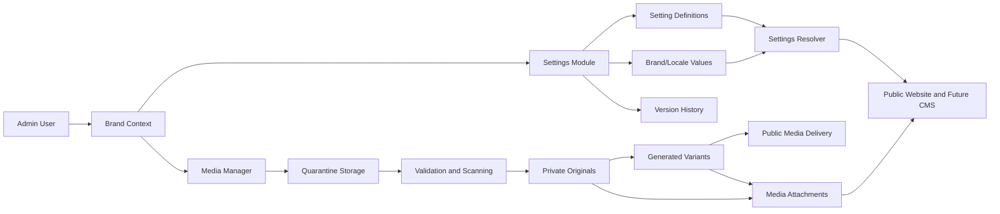
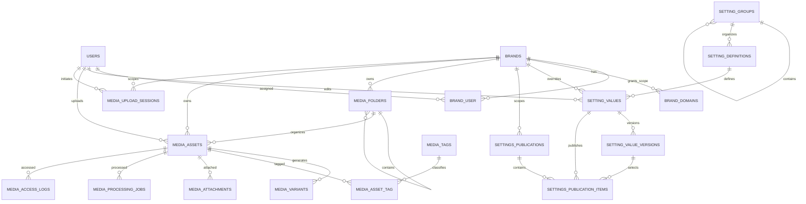
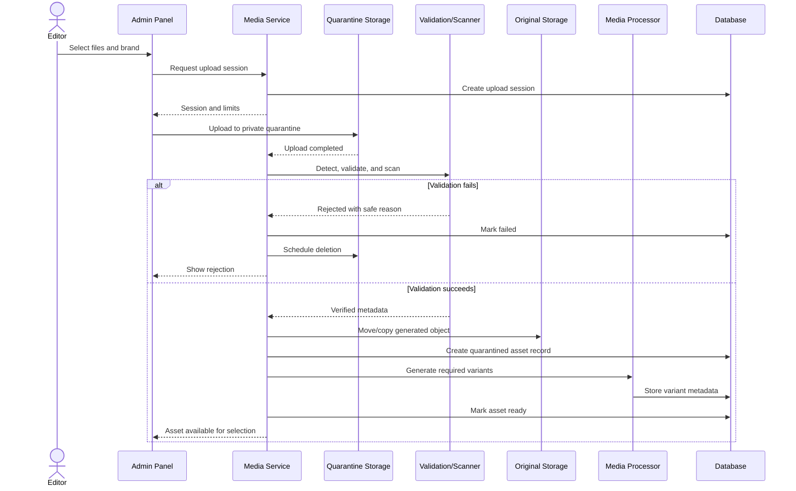

# Settings and Media Architecture

**Project:** MAAC Durgapur  
**Document type:** Architecture proposal  
**Status:** Awaiting approval  
**Prepared:** 19 June 2026  
**Scope:** Settings Module and Media Manager foundation  

## 1. Purpose

This architecture establishes the shared foundation required to make at least
95% of website content manageable from the admin panel.

It supports the three brands from the first implementation phase:

- MAAC
- AKSHA
- Space-E-Fic

The design introduces:

- Typed, validated, brand-aware settings
- Global defaults with controlled brand overrides
- A reusable media library
- Public and private storage separation
- Secure upload processing
- Reusable media relationships for future CMS modules
- Role-based administrative permissions
- Version-aware publishing and rollback

This document defines architecture only. It does not authorize migrations,
models, controllers, storage changes, data movement, or UI implementation.

## 2. Architectural Principles

### 2.1 One content platform, multiple brands

All brands use the same application, database, admin panel, media library, and
CMS framework. Brand-specific content is separated through explicit
`brand_id` relationships rather than separate tables or duplicated code.

### 2.2 Global defaults with brand overrides

Shared settings may be defined globally and overridden by a brand. Resolution
uses this order:

1. Brand-and-locale value
2. Brand default-locale value
3. Global-and-locale value
4. Global default-locale value
5. Definition default

This prevents unnecessary duplication while allowing each brand to control its
identity and content.

### 2.3 Typed settings, not an unrestricted key/value dump

Every setting key has a definition containing:

- Data type
- Validation rules
- Group and label
- Whether it is brand-overridable
- Whether it is translatable
- Whether it is sensitive
- Default value
- Supported UI control

Administrators may edit approved setting values but may not invent arbitrary
runtime configuration keys.

### 2.4 Media is an independent reusable domain

A media file is stored once and may be attached to many settings or future CMS
records. Content tables store media references rather than filesystem paths.

### 2.5 Private by default

New uploads are quarantined and private until validation and processing
complete. Only approved public derivatives are publishable from the public
website.

### 2.6 Stable identifiers

Storage paths use generated UUIDs or immutable asset identifiers. Original
client filenames are retained only as metadata and are never trusted as
filesystem names.

### 2.7 Storage-provider independence

Database records identify logical storage disks and object keys. Application
features do not depend on XAMPP paths, Windows path separators, or a specific
cloud provider.

### 2.8 Publishing is auditable and reversible

Settings and media lifecycle changes record actor, timestamp, and before/after
state. Critical settings support version restoration without reverting schema.

## 3. Scope Boundaries

### Included

- Brand foundation
- Settings definitions and values
- Theme and global visual settings
- Media library metadata
- Media folders, tags, variants, and attachments
- Public/private storage strategy
- Upload validation and processing workflow
- Administrative navigation and permissions
- Compatibility contracts for future CMS modules

### Excluded

- Page Builder implementation
- Course, blog, placement, testimonial, FAQ, CRM, or SEO implementation
- Animation Manager implementation
- Existing media migration
- Database migrations
- File movement
- Production object-storage provisioning
- UI coding
- Business-logic changes

## 4. High-Level Architecture



## 5. Database Schema

The proposed schema uses plural snake-case table names, unsigned bigint primary
keys, UUID public identifiers where assets may appear outside the database,
timestamps, and soft deletion where recovery is operationally valuable.

JSON fields are used for structured metadata, validation definitions, and
non-query-critical configuration. Core ownership, status, scope, and
relationship fields remain relational and indexed.

## 6. Brand Foundation Tables

### 6.1 `brands`

Canonical list of managed brands.

| Column | Type | Constraints / purpose |
|---|---|---|
| `id` | bigint | Primary key |
| `uuid` | UUID | Unique stable external identifier |
| `code` | varchar(50) | Unique; e.g. `maac`, `aksha`, `space_e_fic` |
| `name` | varchar(150) | Administrative display name |
| `legal_name` | varchar(200), nullable | Formal entity name |
| `slug` | varchar(150) | Unique URL-safe identifier |
| `default_locale` | varchar(10) | Default `en` initially |
| `timezone` | varchar(64) | Brand reporting/display timezone |
| `status` | enum/string | `draft`, `active`, `inactive`, `archived` |
| `is_primary` | boolean | Exactly one primary brand |
| `created_by` | bigint, nullable | User who created record |
| `updated_by` | bigint, nullable | Last editor |
| `created_at` | timestamp | Audit timestamp |
| `updated_at` | timestamp | Audit timestamp |
| `deleted_at` | timestamp, nullable | Soft delete |

Recommended constraints:

- Unique `code`
- Unique `slug`
- Unique `uuid`
- Index on `status`
- Application/database rule ensuring only one primary brand

Initial records:

1. MAAC
2. AKSHA
3. Space-E-Fic

### 6.2 `brand_domains`

Maps HTTP hosts to brands and supports future domains, subdomains, preview
hosts, and canonical redirects.

| Column | Type | Constraints / purpose |
|---|---|---|
| `id` | bigint | Primary key |
| `brand_id` | bigint | Foreign key to `brands` |
| `hostname` | varchar(255) | Unique normalized hostname |
| `scheme` | varchar(10) | `http` or `https` |
| `is_primary` | boolean | Canonical domain for brand |
| `is_preview` | boolean | Non-production preview host |
| `redirect_to_primary` | boolean | Canonicalization behavior |
| `status` | enum/string | `active`, `inactive` |
| `created_at` | timestamp | Audit timestamp |
| `updated_at` | timestamp | Audit timestamp |

Constraints:

- Unique normalized `hostname`
- Index on `brand_id`, `status`
- One primary active domain per brand and environment

Environment-specific hostnames should be seeded/configured per environment and
must not cause production domains to resolve in local development.

### 6.3 `brand_user`

Assigns administrative users to brands.

| Column | Type | Constraints / purpose |
|---|---|---|
| `id` | bigint | Primary key |
| `brand_id` | bigint | Foreign key to `brands` |
| `user_id` | bigint | Foreign key to `users` |
| `is_default` | boolean | User's default admin brand |
| `created_at` | timestamp | Audit timestamp |
| `updated_at` | timestamp | Audit timestamp |

Constraints:

- Unique pair: `brand_id`, `user_id`
- Index on `user_id`, `is_default`

RBAC determines what a user may do. This table determines the brands within
which those permissions may be exercised.

## 7. Settings Module Tables

### 7.1 `setting_groups`

Defines admin navigation and visual grouping for settings.

| Column | Type | Constraints / purpose |
|---|---|---|
| `id` | bigint | Primary key |
| `parent_id` | bigint, nullable | Self-reference for nested groups |
| `code` | varchar(100) | Unique stable group code |
| `name` | varchar(150) | Admin label |
| `description` | text, nullable | Administrative help text |
| `icon` | varchar(100), nullable | Admin icon identifier |
| `sort_order` | integer | Navigation/order control |
| `status` | enum/string | `active`, `inactive` |
| `created_at` | timestamp | Audit timestamp |
| `updated_at` | timestamp | Audit timestamp |

Initial groups:

- General
- Brand Identity
- Theme
- Typography
- Header
- Footer
- Contact
- Social Media
- Forms
- Loader
- Visual Effects
- Integrations
- Legal
- System Display

### 7.2 `setting_definitions`

Defines the approved settings contract.

| Column | Type | Constraints / purpose |
|---|---|---|
| `id` | bigint | Primary key |
| `setting_group_id` | bigint | Foreign key to `setting_groups` |
| `key` | varchar(190) | Unique stable key |
| `name` | varchar(190) | Admin label |
| `description` | text, nullable | Editor guidance |
| `data_type` | varchar(50) | Setting value type |
| `input_type` | varchar(50) | Admin control type |
| `default_value` | JSON, nullable | Typed fallback |
| `validation_rules` | JSON, nullable | Server-side validation contract |
| `options` | JSON, nullable | Select options or UI configuration |
| `is_required` | boolean | Value requirement |
| `is_translatable` | boolean | Allows locale-specific values |
| `is_brand_overridable` | boolean | Allows brand-specific value |
| `is_sensitive` | boolean | Restricted/encrypted value |
| `is_public` | boolean | Safe for frontend settings payload |
| `requires_publish` | boolean | Draft/publish workflow required |
| `sort_order` | integer | Field order |
| `status` | enum/string | `active`, `deprecated`, `inactive` |
| `created_at` | timestamp | Audit timestamp |
| `updated_at` | timestamp | Audit timestamp |

Supported `data_type` values:

- `string`
- `text`
- `rich_text`
- `integer`
- `decimal`
- `boolean`
- `color`
- `url`
- `email`
- `phone`
- `date`
- `datetime`
- `json`
- `media`
- `media_collection`
- `font`
- `enum`

Supported `input_type` examples:

- Text input
- Textarea
- Sanitized rich-text editor
- Toggle
- Number input
- Color picker
- Select or multi-select
- Media picker
- Font selector
- URL input
- Repeater/structured JSON editor

Sensitive infrastructure secrets must remain environment-managed. The settings
module must not become a replacement for `.env`. If a future business
integration genuinely requires an admin-managed secret, it must be encrypted,
permission-restricted, masked, excluded from public payloads, and audited.

### 7.3 `setting_values`

Stores global and brand-scoped values.

| Column | Type | Constraints / purpose |
|---|---|---|
| `id` | bigint | Primary key |
| `setting_definition_id` | bigint | Foreign key |
| `brand_id` | bigint, nullable | Null means global value |
| `locale` | varchar(10), nullable | Null for non-translatable values |
| `value` | JSON, nullable | Typed serialized value |
| `status` | enum/string | `draft`, `published`, `archived` |
| `published_at` | timestamp, nullable | Publication time |
| `published_by` | bigint, nullable | Publishing user |
| `created_by` | bigint, nullable | Creating user |
| `updated_by` | bigint, nullable | Last editor |
| `created_at` | timestamp | Audit timestamp |
| `updated_at` | timestamp | Audit timestamp |

Constraints:

- Unique logical scope:
  `setting_definition_id`, `brand_id`, `locale`, `status-currentness`
- Index on `brand_id`, `status`
- Index on `setting_definition_id`, `brand_id`, `locale`

The implementation should avoid relying on nullable-column uniqueness behavior
alone. Global scope may use a normalized scope discriminator or another
database-safe uniqueness strategy.

Media settings store a reference identifier, not a URL or filesystem path.

### 7.4 `setting_value_versions`

Immutable history for restoration and audit.

| Column | Type | Constraints / purpose |
|---|---|---|
| `id` | bigint | Primary key |
| `setting_value_id` | bigint | Foreign key |
| `version_number` | integer | Monotonic per setting value |
| `value` | JSON, nullable | Snapshot |
| `status` | varchar(30) | Snapshot status |
| `change_summary` | varchar(500), nullable | Editor note |
| `created_by` | bigint, nullable | User responsible |
| `created_at` | timestamp | Version timestamp |

Constraints:

- Unique `setting_value_id`, `version_number`
- Index on `created_by`, `created_at`

Restoring a version creates a new version; it does not rewrite historical rows.

### 7.5 `settings_publications`

Groups setting changes into a publication event.

| Column | Type | Constraints / purpose |
|---|---|---|
| `id` | bigint | Primary key |
| `brand_id` | bigint, nullable | Global or brand publication |
| `uuid` | UUID | Stable publication identifier |
| `status` | varchar(30) | `pending`, `published`, `failed`, `rolled_back` |
| `change_summary` | text, nullable | Publication description |
| `published_by` | bigint, nullable | Publishing user |
| `published_at` | timestamp, nullable | Publication timestamp |
| `rolled_back_by` | bigint, nullable | Rollback actor |
| `rolled_back_at` | timestamp, nullable | Rollback timestamp |
| `created_at` | timestamp | Audit timestamp |
| `updated_at` | timestamp | Audit timestamp |

### 7.6 `settings_publication_items`

Captures the exact version included in a publication.

| Column | Type | Constraints / purpose |
|---|---|---|
| `id` | bigint | Primary key |
| `settings_publication_id` | bigint | Foreign key |
| `setting_value_id` | bigint | Foreign key |
| `setting_value_version_id` | bigint | Published version |
| `previous_version_id` | bigint, nullable | Rollback target |
| `created_at` | timestamp | Audit timestamp |

## 8. Recommended Initial Setting Catalogue

### General

- Brand display name
- Short name
- Tagline
- Default locale
- Timezone
- Copyright text
- Default contact email
- Default contact phone
- Primary address
- Google Maps URL/embed reference

### Brand Identity

- Primary logo
- Secondary logo
- Compact logo
- Dark-background logo
- Light-background logo
- Favicon
- Social-sharing default image

### Theme

- Primary color
- Secondary color
- Accent color
- Background color
- Surface color
- Text color
- Muted text color
- Link color
- Button style
- Border-radius scale
- Shadow preset

### Typography

- Heading font
- Body font
- Accent font
- Base font size
- Heading scale
- Font weights
- Line-height scale
- Letter-spacing presets

Font choices should come from an approved catalogue. Arbitrary font upload or
remote script injection must not be permitted.

### Header and Navigation

- Header logo
- Sticky header toggle
- Primary CTA label
- Primary CTA target
- Mobile CTA behavior
- Announcement-bar toggle
- Announcement text

Dynamic menu items belong to the future Menu Builder, not to unrestricted
settings JSON.

### Footer

- Footer logo
- Footer summary
- Contact block
- Legal text
- Social links
- Newsletter visibility
- Footer background media

### Loader

- Loader enabled
- Loader type
- Loader logo/media
- Minimum duration
- Maximum duration
- Background color
- Motion-reduction behavior

Loader timing must not be allowed to indefinitely block page access.

### Global Visual Settings

- Reduced-motion fallback
- Default section spacing
- Image treatment preset
- Video autoplay policy
- Parallax intensity cap
- Global animation enable/disable
- Three.js effects enable/disable
- Mobile visual-effects mode

Detailed per-section animation records belong to the future Animation Manager.

### Forms

- Default success message
- Consent text
- Privacy-policy link
- Notification-recipient business setting
- Spam-protection presentation settings

SMTP credentials, API secrets, and security keys remain environment-managed.

### Social Media

- Facebook
- Instagram
- YouTube
- LinkedIn
- WhatsApp business number
- Other approved channels

### Legal

- Privacy notice summary
- Cookie notice content
- Terms link
- Data-processing consent text
- Media copyright notice

## 9. Media Manager Tables

### 9.1 `media_folders`

Provides virtual organization. Folder changes do not move underlying objects.

| Column | Type | Constraints / purpose |
|---|---|---|
| `id` | bigint | Primary key |
| `uuid` | UUID | Stable identifier |
| `brand_id` | bigint, nullable | Null means shared/global folder |
| `parent_id` | bigint, nullable | Self-referencing hierarchy |
| `name` | varchar(190) | Display name |
| `slug` | varchar(190) | Folder-safe identifier |
| `sort_order` | integer | UI ordering |
| `created_by` | bigint, nullable | Owner/audit |
| `created_at` | timestamp | Audit timestamp |
| `updated_at` | timestamp | Audit timestamp |
| `deleted_at` | timestamp, nullable | Recoverable deletion |

Constraints:

- Unique sibling name/slug per parent and brand
- Index on `brand_id`, `parent_id`

Folders are organizational metadata, not access-control boundaries by
themselves.

### 9.2 `media_assets`

Canonical record for every managed file.

| Column | Type | Constraints / purpose |
|---|---|---|
| `id` | bigint | Primary key |
| `uuid` | UUID | Unique public-safe identifier |
| `brand_id` | bigint, nullable | Owning brand; null means shared |
| `media_folder_id` | bigint, nullable | Virtual folder |
| `uploaded_by` | bigint, nullable | User foreign key |
| `storage_disk` | varchar(100) | Logical configured disk |
| `storage_key` | varchar(1024) | Provider-independent object key |
| `original_filename` | varchar(255) | Display/audit metadata only |
| `display_name` | varchar(255) | Editable admin label |
| `extension` | varchar(20) | Normalized detected extension |
| `mime_type` | varchar(150) | Server-detected MIME |
| `media_type` | varchar(50) | `image`, `video`, `audio`, `document`, `font`, `other` |
| `visibility` | varchar(30) | `private`, `public` |
| `security_classification` | varchar(30) | `public`, `internal`, `personal`, `restricted` |
| `status` | varchar(30) | Lifecycle status |
| `size_bytes` | bigint | Verified size |
| `checksum_sha256` | char(64) | Integrity and duplicate detection |
| `width` | integer, nullable | Image/video width |
| `height` | integer, nullable | Image/video height |
| `duration_ms` | bigint, nullable | Audio/video duration |
| `page_count` | integer, nullable | Document metadata |
| `alt_text` | varchar(500), nullable | Default accessibility text |
| `caption` | text, nullable | Default caption |
| `credit` | varchar(500), nullable | Creator/source attribution |
| `copyright` | varchar(500), nullable | Rights information |
| `focal_x` | decimal, nullable | Image focal point, 0–1 |
| `focal_y` | decimal, nullable | Image focal point, 0–1 |
| `metadata` | JSON, nullable | Safe technical metadata |
| `processing_error` | text, nullable | Sanitized failure reason |
| `published_at` | timestamp, nullable | Public availability time |
| `expires_at` | timestamp, nullable | Optional retention/expiry |
| `created_at` | timestamp | Audit timestamp |
| `updated_at` | timestamp | Audit timestamp |
| `deleted_at` | timestamp, nullable | Soft deletion |

Lifecycle statuses:

- `uploading`
- `quarantined`
- `scanning`
- `processing`
- `ready`
- `failed`
- `archived`
- `deleted`

Indexes:

- Unique `uuid`
- Index on `brand_id`, `status`, `media_type`
- Index on `media_folder_id`
- Index on `uploaded_by`, `created_at`
- Index on `checksum_sha256`, `size_bytes`
- Index on `visibility`, `security_classification`
- Full-text/search index may later cover display name, original filename,
  caption, alt text, and credit

### 9.3 `media_variants`

Stores generated renditions.

| Column | Type | Constraints / purpose |
|---|---|---|
| `id` | bigint | Primary key |
| `media_asset_id` | bigint | Original asset foreign key |
| `name` | varchar(100) | Preset name |
| `storage_disk` | varchar(100) | Variant disk |
| `storage_key` | varchar(1024) | Object key |
| `mime_type` | varchar(150) | Output MIME |
| `extension` | varchar(20) | Output extension |
| `size_bytes` | bigint | Output size |
| `width` | integer, nullable | Output width |
| `height` | integer, nullable | Output height |
| `duration_ms` | bigint, nullable | Output duration |
| `checksum_sha256` | char(64) | Integrity |
| `processing_parameters` | JSON, nullable | Reproducible transformation |
| `status` | varchar(30) | `pending`, `processing`, `ready`, `failed` |
| `created_at` | timestamp | Audit timestamp |
| `updated_at` | timestamp | Audit timestamp |

Constraints:

- Unique `media_asset_id`, `name`
- Index on `status`

Initial image presets should be centrally defined, for example:

- `thumbnail`
- `admin_preview`
- `card`
- `content`
- `hero_desktop`
- `hero_tablet`
- `hero_mobile`
- `social_share`

Actual dimensions and quality levels must be agreed during implementation based
on the frontend's layout requirements.

### 9.4 `media_tags`

Reusable classification terms.

| Column | Type | Constraints / purpose |
|---|---|---|
| `id` | bigint | Primary key |
| `brand_id` | bigint, nullable | Shared or brand-owned tag |
| `name` | varchar(150) | Display name |
| `slug` | varchar(150) | Normalized identifier |
| `created_at` | timestamp | Audit timestamp |
| `updated_at` | timestamp | Audit timestamp |

### 9.5 `media_asset_tag`

Many-to-many pivot between assets and tags.

| Column | Type | Constraints / purpose |
|---|---|---|
| `media_asset_id` | bigint | Asset foreign key |
| `media_tag_id` | bigint | Tag foreign key |
| `created_at` | timestamp | Assignment time |

Unique pair: `media_asset_id`, `media_tag_id`.

### 9.6 `media_attachments`

Generic relationship connecting media to settings and future CMS records.

| Column | Type | Constraints / purpose |
|---|---|---|
| `id` | bigint | Primary key |
| `media_asset_id` | bigint | Asset foreign key |
| `attachable_type` | varchar(190) | Controlled morph-map alias |
| `attachable_id` | bigint | Related record identifier |
| `collection` | varchar(100) | Semantic slot, e.g. `hero_image` |
| `role` | varchar(100), nullable | Additional role |
| `locale` | varchar(10), nullable | Locale-specific attachment |
| `sort_order` | integer | Gallery/order support |
| `metadata` | JSON, nullable | Crop, contextual alt text, link, etc. |
| `created_by` | bigint, nullable | Assignment actor |
| `created_at` | timestamp | Audit timestamp |
| `updated_at` | timestamp | Audit timestamp |

Indexes:

- `attachable_type`, `attachable_id`, `collection`
- `media_asset_id`
- Unique rules appropriate to single-value collections

The application must use a controlled morph map such as `page`, `course`,
`setting_value`, or `testimonial`, not raw PHP class names. This protects
database portability when classes are renamed.

Context-specific alt text may live in attachment metadata because the same
image can require different accessible descriptions in different contexts.

### 9.7 `media_upload_sessions`

Tracks staged uploads and supports safe cancellation or cleanup.

| Column | Type | Constraints / purpose |
|---|---|---|
| `id` | bigint | Primary key |
| `uuid` | UUID | Upload session identifier |
| `brand_id` | bigint, nullable | Upload scope |
| `user_id` | bigint | Uploading user |
| `status` | varchar(30) | `initiated`, `uploading`, `completed`, `failed`, `expired` |
| `expected_size_bytes` | bigint, nullable | Client-declared size |
| `received_size_bytes` | bigint | Actual received bytes |
| `original_filename` | varchar(255) | Display metadata |
| `client_mime_type` | varchar(150), nullable | Untrusted hint |
| `quarantine_key` | varchar(1024) | Temporary private object key |
| `expires_at` | timestamp | Cleanup deadline |
| `completed_at` | timestamp, nullable | Completion time |
| `created_at` | timestamp | Audit timestamp |
| `updated_at` | timestamp | Audit timestamp |

### 9.8 `media_processing_jobs`

Application-level processing history independent of queue infrastructure.

| Column | Type | Constraints / purpose |
|---|---|---|
| `id` | bigint | Primary key |
| `media_asset_id` | bigint | Asset foreign key |
| `operation` | varchar(100) | Scan, metadata, optimize, transcode, variant |
| `status` | varchar(30) | `pending`, `running`, `succeeded`, `failed` |
| `attempt` | integer | Attempt number |
| `input` | JSON, nullable | Safe processing parameters |
| `result` | JSON, nullable | Safe result metadata |
| `error_code` | varchar(100), nullable | Machine-readable failure |
| `error_message` | text, nullable | Sanitized message |
| `started_at` | timestamp, nullable | Processing start |
| `completed_at` | timestamp, nullable | Processing completion |
| `created_at` | timestamp | Audit timestamp |
| `updated_at` | timestamp | Audit timestamp |

### 9.9 `media_access_logs` — optional for public media, required for private documents

Records authorized delivery of personal or restricted media.

| Column | Type | Constraints / purpose |
|---|---|---|
| `id` | bigint | Primary key |
| `media_asset_id` | bigint | Asset foreign key |
| `user_id` | bigint, nullable | Authenticated accessor |
| `purpose` | varchar(190), nullable | Business reason |
| `action` | varchar(50) | `view`, `download`, `share` |
| `ip_hash` | varchar(255), nullable | Privacy-conscious request identifier |
| `user_agent_hash` | varchar(255), nullable | Optional security correlation |
| `created_at` | timestamp | Access time |

This is especially relevant when the Media Manager later handles applicant CVs
or other personal documents.

## 10. Activity and Audit Integration

Settings and media should use the project's future shared activity/audit
architecture rather than creating incompatible logging patterns.

Events to record include:

- Setting created, edited, published, restored, or deprecated
- Media uploaded, scanned, processed, replaced, archived, restored, or deleted
- Media visibility or security classification changed
- Media attached to or detached from content
- Private media viewed or downloaded
- Brand assignment changed
- Bulk operation performed

Audit records should capture:

- Actor
- Brand scope
- Subject type and identifier
- Action
- Before and after values where safe
- Timestamp
- Request correlation identifier
- Reason/comment for destructive or high-risk actions

Passwords, tokens, sensitive settings, and complete private-document metadata
must not be written to logs.

## 11. Entity Relationship Diagram



Polymorphic attachment targets are intentionally represented through the
controlled `attachable_type` and `attachable_id` pair and therefore are not
expanded as physical foreign keys in the diagram.

## 12. Relationship and Deletion Rules

### Brand deletion

- A brand with published content or media cannot be hard-deleted.
- Archiving a brand removes it from normal selection but retains its data.
- Brand deletion must not cascade into media or content automatically.

### Setting definitions

- Definitions referenced by values are deprecated, not deleted.
- Definition keys are immutable after release.
- A replacement definition may supersede a deprecated definition.

### Setting values

- Deleting a draft is permitted according to permission.
- Published values are archived and versioned.
- Brand deletion does not cascade-delete setting history.

### Media assets

- Assets in use cannot be hard-deleted.
- Soft deletion moves assets to trash.
- Purge is a separately permissioned, delayed operation.
- Purge is blocked while active attachments exist.
- Deleting a source asset also schedules safe deletion of its variants only
  after retention expiry.

### Media folders

- Folder deletion does not delete contained assets.
- Assets move to the parent folder or an Unfiled virtual location.

### Media tags

- Deleting a tag removes assignments, not assets.

### User deletion

- Historical `created_by`, `updated_by`, and `uploaded_by` values should be
  retained where possible or safely nullable.
- Audit history must remain intact.

## 13. Storage Architecture

### 13.1 Logical disks

The application should define storage by purpose:

| Logical disk | Visibility | Purpose |
|---|---|---|
| `media_quarantine` | Private | Incomplete and unverified uploads |
| `media_originals` | Private | Validated source files |
| `media_public` | Public | Approved optimized derivatives |
| `media_private` | Private | CVs, certificates, internal documents |
| `media_temp` | Private | Short-lived processing workspace |

These are logical names. Local development may use local filesystem adapters;
production may use object storage.

### 13.2 Environment mapping

#### Local development

- Storage remains outside the Apache document root wherever possible.
- Public derivatives may be exposed through Laravel's standard public-storage
  mapping or an approved media delivery route.
- Private files are delivered only after authorization.
- Paths use forward-slash object keys.

#### Production

Preferred target:

- Private object storage for quarantine, originals, and restricted media
- Public object storage or CDN origin for approved derivatives
- Signed, short-lived URLs or authorized streaming for private files
- Object versioning and lifecycle rules
- Encryption at rest
- TLS in transit

The database must not store absolute filesystem paths or full CDN URLs.

### 13.3 Object-key organization

Recommended logical layout:

```text
quarantine/{brand_uuid}/{upload_session_uuid}/{generated_filename}
originals/{brand_uuid}/{yyyy}/{mm}/{asset_uuid}/original.{ext}
variants/{brand_uuid}/{yyyy}/{mm}/{asset_uuid}/{preset}.{ext}
private/{brand_uuid}/{classification}/{yyyy}/{mm}/{asset_uuid}/file.{ext}
temp/{operation_uuid}/...
```

Shared assets use a reserved global scope:

```text
originals/global/{yyyy}/{mm}/{asset_uuid}/original.{ext}
```

Properties:

- No client filename in the object key
- No email, phone, student name, lead ID, or other personal data in paths
- No dependence on content slugs
- Stable asset UUID
- Predictable cleanup boundaries

### 13.4 Delivery strategy

#### Public media

Public pages resolve an approved variant URL through a media URL service.
Delivery may use:

- Local public storage during development
- CDN-backed object URLs in production
- Cache-busted URLs based on immutable variant identity/checksum

#### Private media

Private assets are never exposed through direct public storage paths.

Request flow:

```text
Authenticated request
  -> authorization policy
  -> brand-scope check
  -> purpose/access audit
  -> short-lived signed URL or streamed response
```

The response should use safe content-disposition headers, explicit MIME types,
no-sniff protection, and private/no-store caching as appropriate.

## 14. File Organization in the Admin UI

The Media Manager presents virtual organization independent of storage keys.

Recommended initial folders per brand:

```text
Brand Library
├── Logos
├── Theme
├── Homepage
│   ├── Hero
│   ├── Sections
│   └── Backgrounds
├── Courses
├── Placements
├── Testimonials
├── Blog
├── Team
├── Gallery
├── Videos
├── Documents
└── Archive
```

A Shared Library contains reusable cross-brand assets approved for shared use.

System views:

- All Media
- Recently Uploaded
- My Uploads
- Unfiled
- Processing
- Failed
- In Use
- Unused
- Private
- Expiring
- Trash

Folder names and tags are for editor organization. CMS modules should use
semantic attachments rather than assuming a physical or virtual folder.

## 15. Upload Security

### 15.1 General controls

Every upload must pass:

1. Authentication
2. Permission check
3. Brand-scope authorization
4. Request size and rate limits
5. Server-side MIME detection
6. Extension allowlist validation
7. File-signature validation
8. Malware scanning
9. Parser/decoder validation
10. Metadata sanitization
11. Safe filename generation
12. Processing and derivative generation
13. Publication eligibility check

Client-provided MIME type, extension, filename, dimensions, and metadata are
untrusted.

### 15.2 Initial allowlist

Final limits require implementation review, but the initial architecture should
support a restrictive allowlist.

#### Images

- JPEG
- PNG
- WebP
- AVIF when the processing stack is verified
- SVG only through a dedicated sanitization pipeline and stricter permission

SVG is active content and must never be treated as an ordinary image upload.
If secure sanitization is unavailable, SVG upload remains disabled.

#### Video

- MP4 with approved codecs
- WebM when supported

Video must be probed server-side. A valid extension is insufficient.

#### Documents

- PDF for approved business use
- DOC/DOCX only when a private workflow requires them

Documents are private by default and must not be embeddable as executable
content.

#### Explicitly denied

- PHP and PHP variants
- PHAR
- HTML/HTM
- JavaScript
- Shell and script formats
- Server configuration files
- Archives by default
- Executables and installers
- Macro-enabled office documents unless separately approved
- Files with double extensions or ambiguous signatures

### 15.3 Limits

Limits should be configurable by approved media type but enforced in server
configuration and application validation.

Controls include:

- Maximum request size
- Maximum file size
- Maximum image pixel count
- Maximum width/height
- Maximum video duration/resolution
- Maximum PDF page count
- Maximum files per upload session
- Per-user and per-IP rate limits
- Per-brand storage quota

Image decompression bombs must be rejected using pixel-count and decoder
resource limits, not file size alone.

### 15.4 Image processing

- Decode and re-encode raster images to remove unsafe embedded data
- Strip unnecessary EXIF/IPTC metadata
- Preserve orientation correctly
- Retain only approved copyright/credit metadata in database fields
- Generate optimized responsive variants
- Validate dimensions after decoding
- Avoid upscaling unless a defined preset requires it

### 15.5 Video processing

- Probe codec, duration, dimensions, and streams
- Reject unexpected additional streams or malformed containers
- Generate poster image
- Produce approved web delivery format when required
- Keep source private
- Publish only processed output

### 15.6 Document controls

- Store privately
- Malware scan
- Validate format signature
- Serve as attachment unless inline display is explicitly approved
- Use authorization and access logs
- Apply retention rules for personal documents
- Never expose CVs or certificates through predictable URLs

## 16. Upload Workflow



### Detailed workflow

1. User selects a brand before uploading.
2. Permission and brand assignment are checked.
3. An expiring upload session is created.
4. The file enters private quarantine.
5. The server independently determines type and properties.
6. The malware scanner and format validator run.
7. A SHA-256 checksum is calculated.
8. Exact duplicates are identified.
9. The user may reuse an existing authorized asset instead of duplicating it.
10. A generated storage key is assigned.
11. The verified original is stored privately.
12. Required variants are generated asynchronously.
13. The asset becomes `ready`.
14. Public visibility is granted only when the asset type, classification, and
    workflow permit it.
15. The editor adds alt text, caption, credit, tags, and folder placement.
16. The asset is attached to a setting or future CMS record.
17. Publication activates the selected media relationship.

Failed or abandoned quarantine objects are automatically purged after a short,
documented retention period.

## 17. Replacement and Version Behavior

Media assets should be immutable at the file-content level.

“Replace file” creates a new asset or new asset version and updates selected
attachments after confirmation. It must not silently overwrite an object at
the same URL because:

- Existing content may rely on the old dimensions
- CDN/browser caches may retain old bytes
- Rollback would be impossible
- Audit history would be ambiguous

The admin UI should offer:

- Replace only this attachment
- Replace all approved references
- Keep both assets
- Cancel

Bulk replacement requires elevated permission and impact preview.

## 18. Admin Navigation Structure

```text
Admin
├── Dashboard
├── Brand Switcher
├── Content
│   └── Future CMS modules
├── Media
│   ├── Library
│   ├── Upload
│   ├── Folders
│   ├── Tags
│   ├── Processing
│   ├── Private Media
│   ├── Unused Media
│   └── Trash
├── Settings
│   ├── General
│   ├── Brand Identity
│   ├── Theme
│   ├── Typography
│   ├── Header
│   ├── Footer
│   ├── Contact
│   ├── Social Media
│   ├── Forms
│   ├── Loader
│   ├── Global Visual Settings
│   ├── Legal
│   └── Publication History
├── Access Control
│   ├── Users
│   ├── Roles
│   └── Permissions
└── Audit
    ├── Activity Log
    ├── Settings History
    ├── Media Activity
    └── Private File Access
```

The Brand Switcher is persistent in the admin header. Every scoped page clearly
shows the current brand. Shared/global scope is visible only to authorized
users and must not be silently selected.

## 19. Settings Admin UI

### 19.1 Settings overview

- Brand selector
- Locale selector where enabled
- Search by setting name/key
- Group navigation
- Draft-change indicator
- Last published timestamp and actor
- Preview action
- Save draft
- Publish
- Discard draft
- Compare with published
- Version history

### 19.2 Inheritance display

Every field shows whether its effective value comes from:

- Brand override
- Global value
- Definition default

Available actions:

- Add brand override
- Reset to inherited value
- Compare global and brand values

Resetting an override removes or archives only the brand-specific value; it
does not copy the current global value into the brand.

### 19.3 Theme preview

Theme settings should support a preview mode scoped to:

- Brand
- Draft publication
- Current authenticated editor
- Expiring preview token

Preview must not publish changes or leak unpublished settings through a public
settings endpoint.

### 19.4 Validation

- Server-side validation is authoritative.
- Client-side validation mirrors server rules for usability.
- Color contrast warnings support accessibility.
- Required media dimensions/aspect ratios are shown before selection.
- Unsafe rich HTML is rejected or sanitized.
- URLs are normalized and restricted to approved schemes.

## 20. Media Admin UI

### 20.1 Library

Views:

- Grid
- Compact list
- Detailed table

Filters:

- Brand/shared
- Folder
- Media type
- Visibility
- Security classification
- Status
- Tag
- Uploaded by
- Upload date
- Dimensions/orientation
- In-use/unused

Search:

- Display name
- Original filename
- Alt text
- Caption
- Credit
- UUID

### 20.2 Asset details panel

- Preview
- Display name
- Original filename
- Brand ownership
- Folder and tags
- MIME and media type
- Dimensions/duration/page count
- File size
- Alt text
- Caption
- Credit/copyright
- Focal point
- Visibility and classification
- Processing status
- Generated variants
- Usage references
- Upload actor/date
- Replace action
- Archive/trash action

### 20.3 Media picker

The reusable picker is available from settings and future CMS forms.

It receives a field contract:

- Allowed media types
- Required/optional
- Single/multiple selection
- Minimum dimensions
- Aspect-ratio guidance
- Maximum file size
- Public/private eligibility
- Brand/shared eligibility
- Required alt text

The picker should allow selection from the library or authorized upload without
leaving the current form.

### 20.4 Destructive-action safeguards

- In-use assets show every known reference.
- Delete is replaced by “Move to trash.”
- Purge requires explicit elevated permission.
- Bulk operations show affected item counts.
- Private media changes require a reason.
- Assets with unresolved processing failures cannot be published.

## 21. Permissions

Recommended permission namespace:

### Brand permissions

- `brands.view`
- `brands.manage`
- `brands.assign_users`
- `brands.manage_domains`
- `brands.access_global_scope`

### Settings permissions

- `settings.view`
- `settings.edit`
- `settings.edit_global`
- `settings.edit_theme`
- `settings.edit_legal`
- `settings.edit_sensitive`
- `settings.publish`
- `settings.rollback`
- `settings.manage_definitions`

### Media permissions

- `media.view`
- `media.upload`
- `media.edit_metadata`
- `media.organize`
- `media.attach`
- `media.publish`
- `media.replace`
- `media.archive`
- `media.restore`
- `media.purge`
- `media.view_private`
- `media.download_private`
- `media.manage_shared`
- `media.manage_security_classification`

## 22. Role Permission Matrix

| Capability | Super Admin | Brand Admin | Content Manager | Content Editor | Media Manager | Reviewer | Auditor |
|---|:---:|:---:|:---:|:---:|:---:|:---:|:---:|
| View assigned brand settings | ✓ | ✓ | ✓ | ✓ | View | ✓ | ✓ |
| Edit assigned brand settings | ✓ | ✓ | ✓ | Limited | — | — | — |
| Edit global settings | ✓ | — | — | — | — | — | — |
| Manage setting definitions | ✓ | — | — | — | — | — | — |
| Publish brand settings | ✓ | ✓ | ✓ | — | — | ✓ | — |
| Roll back settings | ✓ | ✓ | Limited | — | — | — | — |
| View assigned brand media | ✓ | ✓ | ✓ | ✓ | ✓ | ✓ | ✓ |
| Upload public media | ✓ | ✓ | ✓ | ✓ | ✓ | — | — |
| Edit media metadata | ✓ | ✓ | ✓ | Limited | ✓ | — | — |
| Publish public media | ✓ | ✓ | ✓ | — | ✓ | ✓ | — |
| Manage shared media | ✓ | — | — | — | Limited | — | — |
| Replace in-use media | ✓ | ✓ | Limited | — | ✓ | — | — |
| View private media | ✓ | Conditional | — | — | Conditional | — | Audit metadata |
| Download private media | ✓ | Conditional | — | — | — | — | — |
| Purge media | ✓ | — | — | — | — | — | — |
| View audit history | ✓ | Brand only | Brand only | Own activity | Media activity | Brand only | ✓ |

Notes:

- Every permission is additionally constrained by brand assignment.
- “Conditional” requires a business-specific permission and legitimate purpose.
- Reviewer publish rights may be used in a maker-checker workflow.
- Super Admin access to private media is permissioned and audited, not assumed
  merely from role name.

## 23. Multi-Brand Behavior

### Brand-owned assets

- Visible by default only within the owning brand.
- May be attached only to the owning brand's content.
- Cross-brand reuse requires promotion to the Shared Library or an explicit
  approved sharing relationship.

### Shared assets

- Owned by global scope.
- Available to authorized users across brands.
- Changes affect every consuming brand, so replacement and deletion require
  impact review.

### Brand theme isolation

Each brand independently controls:

- Logos
- Colors
- Typography
- Loader
- Default media
- Header/footer presentation
- Visual-effect defaults

The frontend receives a resolved brand theme, not all brands' settings.

### Brand resolution

The public application resolves brand through:

1. Validated request hostname/domain mapping
2. Explicit route/content association where required
3. Primary-brand fallback only for approved legacy routes

The application must not trust an arbitrary client-supplied `brand_id`.

## 24. Future CMS Compatibility

### 24.1 Content contract

Future CMS entities should include an explicit `brand_id`, lifecycle status,
versioning strategy, and media attachments.

Examples:

- Pages
- Page sections
- Courses
- Blog posts
- FAQs
- Testimonials
- Placements
- Menus
- SEO records
- Animation configurations

### 24.2 Media contract

CMS modules should:

- Reference `media_assets` through `media_attachments`
- Use named collections such as `featured_image`, `hero_video`, or `gallery`
- Request named variants rather than constructing paths
- Store contextual alt text when required
- Never store absolute URLs or local filesystem paths
- Check brand ownership before attachment

### 24.3 Settings contract

CMS modules should:

- Use settings only for global/brand presentation and reusable configuration
- Use dedicated content tables for repeatable or relational business content
- Resolve settings through a centralized typed resolver
- Cache resolved settings by brand, locale, and publication version
- Invalidate only affected cache keys after publication

### 24.4 Avoiding the “settings as CMS” anti-pattern

The Settings Module is appropriate for:

- Brand identity
- Global theme
- Contact information
- Shared labels
- Feature presentation
- Reusable defaults

Dedicated CMS tables are required for:

- Repeatable homepage sections
- Menus
- Courses
- Blog posts
- FAQs
- Testimonials
- Placements
- Leads
- Analytics events

This distinction keeps content searchable, relational, versionable, and
scalable.

### 24.5 API readiness

Future read APIs may expose a sanitized, cached projection containing:

- Resolved public settings for one brand
- Published media URLs and metadata
- Current theme tokens

They must never expose:

- Sensitive settings
- Storage keys for private files
- Internal processing metadata
- Other brands' unpublished data
- Original private media URLs

## 25. Caching Strategy

### Settings

Cache the resolved public settings bundle by:

```text
brand + locale + publication version
```

Cache invalidation occurs after a successful publication transaction, not on
every draft save.

### Media

- Media metadata may be cached by asset UUID.
- Public variant URLs should be immutable or checksum-versioned.
- Private signed URLs are short-lived and should not be persisted as content.
- Failed or processing assets must not be cached as publishable.

### Frontend

The frontend should receive only the settings required by the rendered page.
Large unrestricted settings JSON must not be injected into every Blade page.

## 26. Transaction and Consistency Requirements

### Settings publication

A publication should atomically:

1. Validate all included setting values.
2. Verify referenced media is ready and eligible.
3. Create version records.
4. Mark selected values published.
5. Record publication items.
6. Commit the database transaction.
7. Invalidate relevant caches after commit.

If cache invalidation fails, the publication remains recorded and the cache
operation can be retried safely.

### Media processing

Database transactions cannot cover external object storage. Media operations
therefore use compensating actions:

- Write object
- Verify object/checksum
- Commit metadata
- Schedule orphan cleanup on failure

Scheduled reconciliation should identify:

- Database records with missing objects
- Objects with no database record
- Missing required variants
- Expired quarantine files
- Soft-deleted media past retention

## 27. Data Migration Considerations

Migration is outside this document's authorized execution scope, but future
planning must account for:

- `public/upload/`
- Root `upload/`
- Existing database path strings
- Windows backslashes in course paths
- Duplicate files across upload trees
- Missing files referenced by database records
- Files with no database reference
- Public applicant documents requiring private classification
- Original filenames that may contain unsafe or personal data

Future migration should:

1. Inventory without moving files.
2. Classify public versus private.
3. Hash files for duplicate detection.
4. Create asset records.
5. Generate safe storage keys.
6. Copy and verify before source deletion.
7. Build attachment mappings.
8. Validate rendered pages.
9. Retain a rollback manifest.
10. Remove legacy files only after approval and retention expiry.

## 28. Rollback Considerations

### Architecture-level rollback

Implementation should be additive initially:

- Existing settings and path columns remain authoritative during shadow mode.
- New settings/media records are populated and validated in parallel.
- Reads switch through feature flags or module-level configuration.
- Legacy columns are not removed during the first release.

### Settings rollback

- Every publication stores the prior version.
- Rollback creates a new publication pointing to restored values.
- Cache keys advance to the rollback publication version.
- Audit history remains immutable.

### Media rollback

- Original legacy files remain untouched during initial migration.
- Storage-copy checksums are recorded.
- Attachment changes are versioned or included in a deployment manifest.
- Replaced assets remain retained for the rollback window.
- CDN URLs are immutable, preventing old bytes from being overwritten.

### Deployment rollback

Before enabling the new modules:

- Back up relevant database tables.
- Export configuration and storage manifests.
- Verify object-storage versioning or backup.
- Record feature-flag state.
- Test restoration in a non-production environment.

Rollback sequence:

1. Disable new settings/media writes.
2. Restore legacy read path through the feature flag.
3. Restore prior publication if needed.
4. Retain newly uploaded objects in quarantine/archive for investigation.
5. Reconcile records and objects.
6. Do not destructively delete new data during emergency rollback.

### Irreversible operations

The following require explicit approval, verified backup, and a completed
retention period:

- Hard deletion of media
- Removal of legacy upload trees
- Removal of legacy path columns
- Destruction of settings version history
- Reclassification of private media as public

## 29. Operational and Security Monitoring

Recommended alerts:

- Repeated upload validation failures
- Malware detection
- Upload-rate anomalies
- Private file download anomalies
- Processing backlog
- Variant-generation failures
- Missing storage objects
- Public attachment to private/restricted asset
- Cross-brand access denial spikes
- Large setting publication or rollback
- Storage quota threshold
- Quarantine cleanup failure

Recommended metrics:

- Assets by status/type/brand
- Processing duration and failure rate
- Storage consumption by brand/classification
- Unused asset count
- Settings publication frequency
- Cache hit rate for settings
- Private-access volume

## 30. Implementation Dependencies

This architecture depends on:

1. Completed public document-root containment
2. Production environment hardening
3. RBAC foundation
4. Brand-scoped authorization policies
5. Queue worker capability for media processing
6. Malware-scanning decision
7. Image/video processing capability assessment
8. Storage-provider decision for production
9. Audit-log foundation
10. Backup and restoration procedures

The architecture can be developed locally using filesystem storage, but
production activation should not occur without queue, private storage,
monitoring, and backup decisions.

## 31. Recommended Delivery Sequence

### Stage 1 — Contracts and brand foundation

- Confirm brand records and domain model
- Approve settings catalogue
- Approve media classifications
- Approve permissions
- Define storage disks and retention rules

### Stage 2 — Settings foundation

- Settings groups and definitions
- Brand/locale value resolution
- Draft and publication versions
- Admin settings forms
- Theme preview

### Stage 3 — Media foundation

- Media metadata and folders
- Secure quarantine workflow
- Image processing
- Media library and picker
- Attachments

### Stage 4 — Controlled migration

- Inventory current media
- Shadow-import settings and assets
- Validate mappings
- Switch selected modules
- Maintain rollback path

### Stage 5 — CMS adoption

- Homepage Builder
- Menus
- Courses
- Testimonials
- FAQs
- Blog
- Placements
- SEO and Animation Manager integration

## 32. Acceptance Criteria for Future Implementation

The architecture is successfully implemented only when:

1. MAAC, AKSHA, and Space-E-Fic are first-class brand records.
2. Admin users see and modify only assigned brand data.
3. Global settings can be inherited and safely overridden per brand.
4. Settings are typed and server-validated.
5. Theme settings control approved logos, colors, typography, loader, and
   global visuals.
6. Draft settings do not affect the public website.
7. Settings publication and rollback are auditable.
8. Uploads enter private quarantine before processing.
9. Executable and unsupported file types are rejected.
10. Originals are private and publishable variants are controlled.
11. CVs and restricted documents cannot be reached by public URLs.
12. Media paths contain no client filename or personal data.
13. An asset can be reused across multiple authorized content records.
14. In-use assets cannot be silently purged.
15. Public pages use media references and variants, not legacy path strings.
16. Media access is constrained by both permission and brand.
17. The Media Picker is reusable by future CMS modules.
18. Public settings payloads exclude sensitive/internal values.
19. Existing content remains available throughout controlled migration.
20. A tested rollback restores the prior read path without data destruction.

## 33. Decisions Requiring Approval Before Implementation

1. Final production storage provider
2. Malware-scanning service or local engine
3. Supported image/video/document types and limits
4. SVG policy
5. Video transcoding scope
6. Media retention and trash period
7. Private-document retention policy
8. Maker-checker requirement for publication
9. Whether brand domains are managed in admin or deployment configuration
10. Initial setting definition catalogue
11. Shared-media governance
12. Legacy-media migration strategy

No implementation should begin until these decisions and the architecture are
approved.
